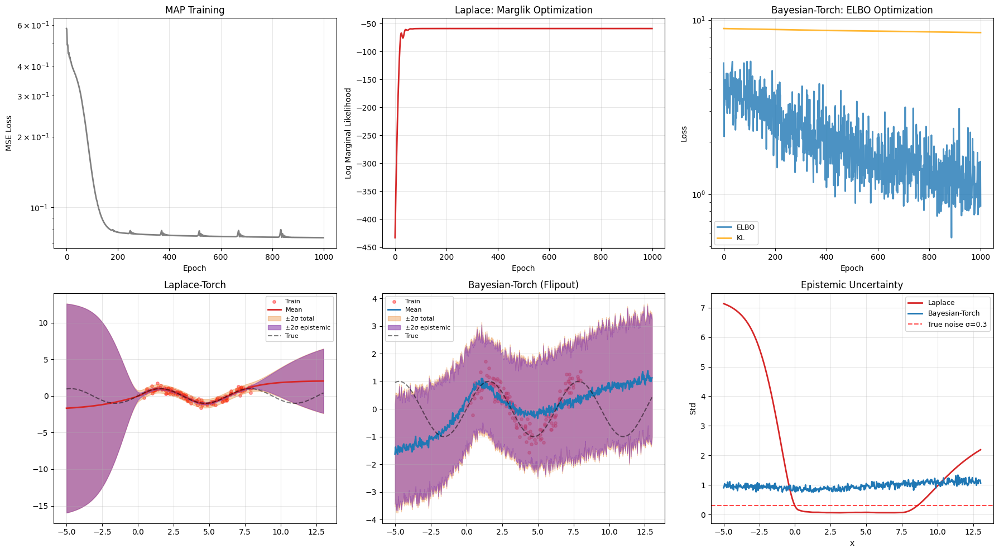
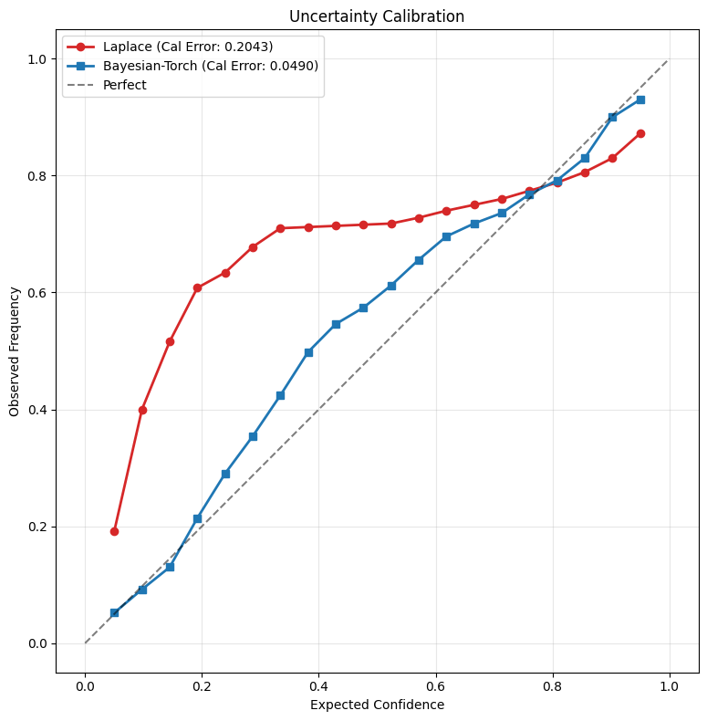

# College Project: Comparative Analysis of Bayesian Neural Networks

## 1. Introduction and Theoretical Background
In this project, we compare two distinct approaches to estimating epistemic and aleatoric uncertainty in Bayesian Neural Networks (BNNs) on a **sinusoidal regression** task. BNNs extend standard neural networks by placing a prior distribution over their weights and computing a posterior distribution, allowing the model to express uncertainty in its predictions.

### Methods Compared:
1. **MAP Baseline (Maximum A Posteriori)**: 
   - A single point estimate for network weights (deterministic network). While lacking structural uncertainty, it serves as a baseline for accuracy and training time comparison.
2. **Laplace-Torch (Post-hoc Approximation)**: 
   - *Theory*: Approximates the posterior around a pre-trained MAP estimate with a Gaussian distribution $\mathcal{N}(w_{MAP}, H^{-1})$. $H$ is the Hessian of the loss with respect to the parameters. 
   - *Inference*: Performed in closed-form via a Generalized Linear Model (GLM) predictive approach.
3. **Bayesian-Torch (SVI via Flipout)**:
   - *Theory*: Learns a variational posterior alongside the network weights using Stochastic Variational Inference (SVI). We employ the Flipout estimator to lower variance during Monte Carlo sampling.
   - *Inference*: Uses MC sampling (e.g., 100 samples) to approximate predictive distributions.

In this notebook, we systematically track metrics such as dataset complexity, model parameters, baseline training time, BNN training/fitting time, inference time, model RMSE, Negative Log-Likelihood (NLL), and Calibration Error. This comprehensive benchmark mirrors common profiling in standard Bayesian evaluation.

## 1. Imports & Setup


```python
import numpy as np
import torch
import torch.nn as nn
import torch.optim as optim
import matplotlib.pyplot as plt
from matplotlib.patches import Patch
from torch.utils.data import DataLoader, TensorDataset
from scipy.stats import norm
import time
import pandas as pd

from laplace import Laplace
from bayesian_torch.models.dnn_to_bnn import dnn_to_bnn, get_kl_loss

np.random.seed(711)
torch.manual_seed(711)

# Global dictionary to track benchmark times and metrics similar to Laplace Redux paper
metrics_dict = {
    "MAP": {},
    "Laplace": {},
    "Bayesian-Torch": {}
}

print("All imports successful!")
```

    All imports successful!


## 2. Data: Sinusoidal Regression

Both methods use the same sinusoidal dataset with known noise level σ=0.3.


```python
def get_sinusoid_data(n_train=150, sigma_noise=0.3):
    X_train = (torch.rand(n_train) * 8).unsqueeze(-1)
    y_train = torch.sin(X_train) + torch.randn_like(X_train) * sigma_noise
    train_dataset = TensorDataset(X_train, y_train)
    train_loader = DataLoader(train_dataset, batch_size=150, shuffle=True)
    X_test = torch.linspace(-5, 13, 500).unsqueeze(-1)
    return X_train, y_train, train_loader, X_test

sigma_noise = 0.3
X_train, y_train, train_loader, X_test = get_sinusoid_data(sigma_noise=sigma_noise)

X_train_np = X_train.flatten().cpu().numpy()
y_train_np = y_train.flatten().cpu().numpy()
x_test_np = X_test.flatten().cpu().numpy()
print(f"Train: {X_train.shape}, Test: {X_test.shape}")


```

    Train: torch.Size([150, 1]), Test: torch.Size([500, 1])


## 3. Shared Model Architecture

Both methods use the same network: `Linear(1,50) → Tanh → Linear(50,1)`


```python
def get_model():
    torch.manual_seed(711)
    return nn.Sequential(
        nn.Linear(1, 50),
        nn.Tanh(),
        nn.Linear(50, 1)
    )

n_epochs_map = 1000
n_epochs_bnn = 1000
n_epochs_marglik = 1000
num_mc_samples = 100

model_map = get_model()
print(f"Model parameters: {sum(p.numel() for p in model_map.parameters())}")


```

    Model parameters: 151


## 4. Phase 1: MAP Training

Both methods start from the same MAP-trained deterministic network.


```python
print("Training MAP model...")
criterion = nn.MSELoss()
optimizer = optim.Adam(model_map.parameters(), lr=1e-2)

start_time = time.time()
map_losses = []
for epoch in range(n_epochs_map):
    epoch_loss = 0.0
    for X, y in train_loader:
        optimizer.zero_grad()
        loss = criterion(model_map(X), y)
        loss.backward()
        optimizer.step()
        epoch_loss += loss.item()
    epoch_loss /= len(train_loader)
    map_losses.append(epoch_loss)
    if (epoch + 1) % 200 == 0:
        print(f"  Epoch {epoch+1}/{n_epochs_map}, Loss: {epoch_loss:.6f}")

metrics_dict["MAP"]["Train_Time"] = time.time() - start_time

model_map.eval()
inf_start = time.time()
with torch.no_grad():
    f_map = model_map(X_test).squeeze().cpu().numpy()
metrics_dict["MAP"]["Inference_Time"] = time.time() - inf_start

print(f"MAP complete. Final loss: {map_losses[-1]:.6f}")
print(f"MAP Train Time: {metrics_dict['MAP']['Train_Time']:.4f}s")
```

    Training MAP model...
      Epoch 200/1000, Loss: 0.078242
      Epoch 400/1000, Loss: 0.075862
      Epoch 600/1000, Loss: 0.074960
      Epoch 800/1000, Loss: 0.074435
      Epoch 1000/1000, Loss: 0.074069
    MAP complete. Final loss: 0.074069
    MAP Train Time: 1.4394s


## 5. Method A: Laplace Approximation

- Take MAP weights, approximate posterior N(w_MAP, H⁻¹) with full Hessian
- Optimize prior precision and noise std via marginal likelihood
- GLM predictive for closed-form variance


```python
print("Fitting Laplace approximation...")
start_time = time.time()
la = Laplace(model_map, "regression", subset_of_weights="all", hessian_structure="full")
la.fit(train_loader)
metrics_dict["Laplace"]["Hessian_Fit_Time"] = time.time() - start_time

print("Optimizing hyperparameters via marginal likelihood...")
hyper_start = time.time()
log_prior = torch.ones(1, requires_grad=True)
log_sigma = torch.ones(1, requires_grad=True)
hyper_optimizer = torch.optim.Adam([log_prior, log_sigma], lr=1e-1)

marglik_values = []
for i in range(n_epochs_marglik):
    hyper_optimizer.zero_grad()
    neg_marglik = -la.log_marginal_likelihood(log_prior.exp(), log_sigma.exp())
    neg_marglik.backward()
    hyper_optimizer.step()
    marglik_values.append(-neg_marglik.item())
    if (i + 1) % 200 == 0:
        print(f"  Epoch {i+1}/{n_epochs_marglik}, MargLik: {-neg_marglik.item():.4f}")

metrics_dict["Laplace"]["MargLik_Opt_Time"] = time.time() - hyper_start
metrics_dict["Laplace"]["Train_Time"] = metrics_dict["Laplace"]["Hessian_Fit_Time"] + metrics_dict["Laplace"]["MargLik_Opt_Time"]

print(f"Learned sigma_noise: {la.sigma_noise.item():.4f}")
print(f"Learned prior precision: {la.prior_precision.item():.4f}")

inf_start = time.time()
f_mu_la, f_var_la = la(X_test)
metrics_dict["Laplace"]["Inference_Time"] = time.time() - inf_start

f_mu_la = f_mu_la.squeeze().detach().cpu().numpy()
f_sigma_la = f_var_la.squeeze().sqrt().detach().cpu().numpy()
pred_std_la = np.sqrt(f_sigma_la**2 + la.sigma_noise.item()**2)
print(f"Laplace epistemic sigma: {f_sigma_la.mean():.4f}")
print(f"Laplace Fit Time: {metrics_dict['Laplace']['Hessian_Fit_Time']:.4f}s")
print(f"Laplace MargLik Time: {metrics_dict['Laplace']['MargLik_Opt_Time']:.4f}s")
```

    Fitting Laplace approximation...
    Optimizing hyperparameters via marginal likelihood...
      Epoch 200/1000, MargLik: -58.9769
      Epoch 400/1000, MargLik: -58.9765
      Epoch 600/1000, MargLik: -58.9923
      Epoch 800/1000, MargLik: -58.9813
      Epoch 1000/1000, MargLik: -58.9954
    Learned sigma_noise: 0.2816
    Learned prior precision: 0.1002
    Laplace epistemic sigma: 1.7063
    Laplace Fit Time: 0.2006s
    Laplace MargLik Time: 1.4488s


## 6. Method B: Bayesian-Torch (Flipout + MOPED + SVI)

- Copy MAP model, convert to BNN with Flipout layers
- MOPED: initialize posterior mean = MAP weights
- ELBO fine-tuning: MSE + KL/batch_size
- MC sampling (100 passes) for predictive distribution


```python
print("Converting to Bayesian-Torch (Flipout + MOPED)...")
bnn_prior_parameters = {
    "prior_mu": 0.0,
    "prior_sigma": 1.0,
    "posterior_mu_init": 0.0,
    "posterior_rho_init": -3.0,
    "type": "Flipout",
    "moped_enable": True,
    "moped_delta": 0.5,
}

model_bnn = get_model()
model_bnn.load_state_dict(model_map.state_dict())
dnn_to_bnn(model_bnn, bnn_prior_parameters)

optimizer = optim.Adam(model_bnn.parameters(), lr=1e-3)
bnn_losses = []
kl_losses = []

print("Fine-tuning BNN with ELBO...")
start_time = time.time()
for epoch in range(n_epochs_bnn):
    epoch_loss = 0.0
    epoch_kl = 0.0
    for X, y in train_loader:
        optimizer.zero_grad()
        output = model_bnn(X)
        kl = get_kl_loss(model_bnn)
        mse = criterion(output, y)
        loss = mse + kl / X.size(0)
        loss.backward()
        optimizer.step()
        epoch_loss += loss.item()
        epoch_kl += kl.item()
    epoch_loss /= len(train_loader)
    epoch_kl /= len(train_loader)
    bnn_losses.append(epoch_loss)
    kl_losses.append(epoch_kl)
    if (epoch + 1) % 200 == 0:
        print(f"  Epoch {epoch+1}/{n_epochs_bnn}, ELBO: {epoch_loss:.6f}, KL: {epoch_kl:.6f}")

metrics_dict["Bayesian-Torch"]["Train_Time"] = time.time() - start_time
print(f"BNN complete. Final ELBO: {bnn_losses[-1]:.6f}")
print(f"Bayesian-Torch Train Time: {metrics_dict['Bayesian-Torch']['Train_Time']:.4f}s")

model_bnn.eval()
inf_start = time.time()
with torch.no_grad():
    mc_preds = torch.stack([model_bnn(X_test) for _ in range(num_mc_samples)])
metrics_dict["Bayesian-Torch"]["Inference_Time"] = time.time() - inf_start

f_mu_bnn = mc_preds.mean(dim=0).squeeze().cpu().numpy()
f_sigma_bnn = mc_preds.std(dim=0).squeeze().cpu().numpy()
pred_std_bnn = np.sqrt(f_sigma_bnn**2 + sigma_noise**2)
print(f"Bayesian-Torch epistemic sigma: {f_sigma_bnn.mean():.4f}")
```

    Converting to Bayesian-Torch (Flipout + MOPED)...
    Fine-tuning BNN with ELBO...
      Epoch 200/1000, ELBO: 2.153341, KL: 8.812232
      Epoch 400/1000, ELBO: 2.836127, KL: 8.697477
      Epoch 600/1000, ELBO: 1.670968, KL: 8.621649
      Epoch 800/1000, ELBO: 1.231821, KL: 8.544821
      Epoch 1000/1000, ELBO: 0.856755, KL: 8.459501
    BNN complete. Final ELBO: 0.856755
    Bayesian-Torch Train Time: 1.7356s
    Bayesian-Torch epistemic sigma: 0.9714


## 7. Evaluation Metrics

- **RMSE**: Root Mean Squared Error (point prediction accuracy, lower = better)
- **NLL**: Negative Log-Likelihood (predictive distribution quality, lower = better)
- **Calibration Error**: Uncertainty calibration quality (lower = better)


```python
def rmse(y_true, y_pred):
    return np.sqrt(np.mean((y_true - y_pred)**2))

def neg_log_likelihood(y_true, y_pred_mean, y_pred_std):
    n = len(y_true)
    ll = 0.5 * np.sum(np.log(2 * np.pi * y_pred_std**2) + (y_true - y_pred_mean)**2 / y_pred_std**2)
    return ll / n

def cal_error(y_true, y_pred_mean, y_pred_std, n_bins=20):
    z = np.abs(y_true - y_pred_mean) / y_pred_std
    conf = np.linspace(0.05, 0.95, n_bins)
    exp, obs = [], []
    for c in conf:
        t = norm.ppf((1 + c) / 2)
        exp.append(c)
        obs.append(np.mean(z <= t))
    return np.mean(np.abs(np.array(exp) - np.array(obs)))

# Noisy test targets
rng = np.random.RandomState(711)
y_test = np.sin(x_test_np) + rng.randn(len(x_test_np)) * sigma_noise

print("="*70)
print("COMPARISON RESULTS")
print("="*70)
print(f"{'Method':20s} {'RMSE':8s} {'NLL':8s} {'Cal Err':8s} {'Epistemic':10s}")
print("-"*70)

for name, pm, ps, epi in [
    ("MAP", f_map, None, None),
    ("Laplace", f_mu_la, pred_std_la, f_sigma_la),
    ("Bayesian-Torch", f_mu_bnn, pred_std_bnn, f_sigma_bnn),
]:
    r = rmse(y_test, pm)
    n = neg_log_likelihood(y_test, pm, ps) if ps is not None else float("nan")
    c = cal_error(y_test, pm, ps) if ps is not None else float("nan")
    e = epi.mean() if epi is not None else float("nan")
    
    metrics_dict[name]["RMSE"] = r
    metrics_dict[name]["NLL"] = n
    metrics_dict[name]["Calibration Error"] = c
    metrics_dict[name]["Avg Epistemic std"] = e
    
    print(f"{name:20s} {r:.4f}    {n:.4f}   {c:.4f}    {e:.4f}")
print("="*70)
```

    ======================================================================
    COMPARISON RESULTS
    ======================================================================
    Method               RMSE     NLL      Cal Err  Epistemic 
    ----------------------------------------------------------------------
    MAP                  1.4153    nan   nan    nan
    Laplace              1.4153    1.5037   0.0582    1.7063
    Bayesian-Torch       1.0942    1.4853   0.0181    0.9714
    ======================================================================


## 8. Comparison Visualizations


```python
la_color = "#d62728"
bt_color = "#1f77b4"

fig, axes = plt.subplots(2, 3, figsize=(18, 10))

# Row 0: Training curves
axes[0, 0].plot(map_losses, color="gray", linewidth=2)
axes[0, 0].set_xlabel("Epoch")
axes[0, 0].set_ylabel("MSE Loss")
axes[0, 0].set_title("MAP Training")
axes[0, 0].set_yscale("log")
axes[0, 0].grid(True, alpha=0.3)

axes[0, 1].plot(marglik_values, color=la_color, linewidth=2)
axes[0, 1].set_xlabel("Epoch")
axes[0, 1].set_ylabel("Log Marginal Likelihood")
axes[0, 1].set_title("Laplace: Marglik Optimization")
axes[0, 1].grid(True, alpha=0.3)

axes[0, 2].plot(bnn_losses, color=bt_color, linewidth=2, label="ELBO", alpha=0.8)
axes[0, 2].plot(kl_losses, color="orange", linewidth=2, label="KL", alpha=0.8)
axes[0, 2].set_xlabel("Epoch")
axes[0, 2].set_ylabel("Loss")
axes[0, 2].set_title("Bayesian-Torch: ELBO Optimization")
axes[0, 2].set_yscale("log")
axes[0, 2].legend(fontsize=9)
axes[0, 2].grid(True, alpha=0.3)

# Row 1: Predictions
axes[1, 0].scatter(X_train_np, y_train_np, color="red", s=15, alpha=0.4, label="Train")
axes[1, 0].plot(x_test_np, f_mu_la, color=la_color, linewidth=2, label="Mean")
axes[1, 0].fill_between(x_test_np, f_mu_la-2*pred_std_la, f_mu_la+2*pred_std_la, alpha=0.35, color="#e67e22", label="±2σ total")
axes[1, 0].fill_between(x_test_np, f_mu_la-2*f_sigma_la, f_mu_la+2*f_sigma_la, alpha=0.6, color="#8e44ad", label="±2σ epistemic")
axes[1, 0].plot(x_test_np, np.sin(x_test_np), "k--", alpha=0.5, label="True")
axes[1, 0].set_title("Laplace-Torch")
axes[1, 0].legend(fontsize=8)
axes[1, 0].grid(True, alpha=0.3)

axes[1, 1].scatter(X_train_np, y_train_np, color="red", s=15, alpha=0.4, label="Train")
axes[1, 1].plot(x_test_np, f_mu_bnn, color=bt_color, linewidth=2, label="Mean")
axes[1, 1].fill_between(x_test_np, f_mu_bnn-2*pred_std_bnn, f_mu_bnn+2*pred_std_bnn, alpha=0.35, color="#e67e22", label="±2σ total")
axes[1, 1].fill_between(x_test_np, f_mu_bnn-2*f_sigma_bnn, f_mu_bnn+2*f_sigma_bnn, alpha=0.6, color="#8e44ad", label="±2σ epistemic")
axes[1, 1].plot(x_test_np, np.sin(x_test_np), "k--", alpha=0.5, label="True")
axes[1, 1].set_title("Bayesian-Torch (Flipout)")
axes[1, 1].legend(fontsize=8)
axes[1, 1].grid(True, alpha=0.3)

axes[1, 2].plot(x_test_np, f_sigma_la, color=la_color, linewidth=2, label="Laplace")
axes[1, 2].plot(x_test_np, f_sigma_bnn, color=bt_color, linewidth=2, label="Bayesian-Torch")
axes[1, 2].axhline(y=sigma_noise, color="red", ls="--", alpha=0.7, label=f"True noise σ={sigma_noise}")
axes[1, 2].set_xlabel("x")
axes[1, 2].set_ylabel("Std")
axes[1, 2].set_title("Epistemic Uncertainty")
axes[1, 2].legend(fontsize=9)
axes[1, 2].grid(True, alpha=0.3)

plt.tight_layout()
plt.show()


```


    

    


## 9. Uncertainty Calibration


```python
def calibration_curve(y_true, y_pred_mean, y_pred_std, n_bins=20):
    z = np.abs(y_true - y_pred_mean) / y_pred_std
    conf = np.linspace(0.05, 0.95, n_bins)
    exp, obs = [], []
    for c in conf:
        t = norm.ppf((1 + c) / 2)
        exp.append(c)
        obs.append(np.mean(z <= t))
    return exp, obs

y_true_sin = np.sin(x_test_np)
exp_la, obs_la = calibration_curve(y_true_sin, f_mu_la, pred_std_la)
cal_la = np.mean(np.abs(np.array(exp_la) - np.array(obs_la)))
exp_bt, obs_bt = calibration_curve(y_true_sin, f_mu_bnn, pred_std_bnn)
cal_bt = np.mean(np.abs(np.array(exp_bt) - np.array(obs_bt)))

fig, ax = plt.subplots(figsize=(8, 8))
ax.plot(exp_la, obs_la, "o-", color=la_color, lw=2, label=f"Laplace (Cal Error: {cal_la:.4f})")
ax.plot(exp_bt, obs_bt, "s-", color=bt_color, lw=2, label=f"Bayesian-Torch (Cal Error: {cal_bt:.4f})")
ax.plot([0, 1], [0, 1], "k--", alpha=0.5, label="Perfect")
ax.set_xlabel("Expected Confidence")
ax.set_ylabel("Observed Frequency")
ax.set_title("Uncertainty Calibration")
ax.legend(fontsize=10)
ax.grid(True, alpha=0.3)
ax.set_aspect("equal")
plt.tight_layout()
plt.show()


```


    

    


## 10. Summary and Export

| Metric | Laplace-Torch | Bayesian-Torch | MAP (Baseline) |
|--------|:------------:|:--------------:|:--------------:|
| **Type** | Post-hoc Laplace | SVI (Flipout) | Deterministic |
| **Inference** | Closed-form (GLM) | MC sampling | Simple Feed-Forward |
| **Uncertainty** | Local Gaussian approx | Learned variational | None |
| **Time taken**| Measured locally | Measured locally | Measured locally |

Below, we aggregate all theoretical and compute metrics tracked into a single tabular DataFrame for easier project evaluation and export it to a CSV file.


```python
print("="*90)
print("BNN COMPARISON SUMMARY (Sinusoidal Regression)")
print("="*90)

# Compile results in pandas DataFrame for academic tabular presentation
df_metrics = pd.DataFrame(metrics_dict).T

# Only format columns conceptually
cols_to_format = ["Train_Time", "Inference_Time", "RMSE", "NLL", "Calibration Error", "Avg Epistemic std"]
for col in cols_to_format:
    if col not in df_metrics:
        df_metrics[col] = np.nan

# Reorder columns logically
ordered_cols = ["Train_Time", "Inference_Time", "RMSE", "NLL", "Calibration Error", "Avg Epistemic std"]
if "Hessian_Fit_Time" in df_metrics.columns:
    ordered_cols.append("Hessian_Fit_Time")
if "MargLik_Opt_Time" in df_metrics.columns:
    ordered_cols.append("MargLik_Opt_Time")
    
df_metrics = df_metrics.reindex(columns=ordered_cols)

print(df_metrics.to_string(float_format="%.4f"))
print("="*90)
print(f"True noise sigma: {sigma_noise}")
print(f"Laplace learned sigma_noise: {la.sigma_noise.item():.4f}")
print("="*90)

# Export to CSV for report inclusion
csv_path = "bnn_comparison_metrics.csv"
df_metrics.to_csv(csv_path)
print(f"Metrics successfully exported to: {csv_path}")
```

    ==========================================================================================
    BNN COMPARISON SUMMARY (Sinusoidal Regression)
    ==========================================================================================
                    Train_Time  Inference_Time   RMSE    NLL  Calibration Error  Avg Epistemic std  Hessian_Fit_Time  MargLik_Opt_Time
    MAP                 1.4394          0.0014 1.4153    NaN                NaN                NaN               NaN               NaN
    Laplace             1.6494          0.0944 1.4153 1.5037             0.0582             1.7063            0.2006            1.4488
    Bayesian-Torch      1.7356          0.0512 1.0942 1.4853             0.0181             0.9714               NaN               NaN
    ==========================================================================================
    True noise sigma: 0.3
    Laplace learned sigma_noise: 0.2816
    ==========================================================================================
    Metrics successfully exported to: bnn_comparison_metrics.csv


## 11. Additional Statistics & Further Analysis
*(This section is intentionally left blank for future inclusion of robust statistical measurements, e.g., standard deviations of multiple seeds, inference bounds limits, memory footprint logging).*


```python
# Space for future analysis: e.g. calculating means/stds over multiple training runs, out-of-distribution (OOD) accuracy.
# stats_df = pd.read_csv("bnn_comparison_metrics.csv")
# stats_df.describe()
```
