# BNN Classification on Two Moons using ```laplace-torch```

In this project, we utilize the classic Two Moons dataset to demonstrate uncertainty quantification using Laplace Approximation through the ```laplace-torch``` library. 


```python
from pathlib import Path
import sys
import time
import os
import copy
import types
import torch
import torch.nn as nn
import torch.nn.functional as F
import numpy as np
import pandas as pd
import matplotlib.pyplot as plt
import matplotlib.colors as mcolors
from sklearn.metrics import log_loss
from laplace import Laplace

ROOT = Path.cwd().resolve()
while ROOT != ROOT.parent and not (ROOT / 'shared').exists():
    ROOT = ROOT.parent
if str(ROOT) not in sys.path:
    sys.path.insert(0, str(ROOT))

from shared import TinyMLP, eval_probs, load_two_moons, train_map, checkpoint_exists, load_checkpoint, save_checkpoint, seed_everything
from shared.two_moons_utils import calibration_curve_data, predict_probs_from_model_or_fn, uncertainty_calibration_summary, predictive_entropy, brier_score ,safe_load_laplace_state

device = torch.device('cuda' if torch.cuda.is_available() else 'cpu')
print(f'Device: {device}')

COLOR_MAP = '#4682B4'    
COLOR_DIAG = '#4682B4'   
COLOR_FULL = '#FF6347'  
COLOR_KRON = '#228B22'   
COLOR_GRID = '#9370DB'   
COLOR_MARGLIK = '#228B22'  

metrics_dict = {
    'MAP Baseline': {},
}

SEED = 42
seed_everything(SEED)

FIGURES_DIR = os.path.join('..', 'figures')
os.makedirs(FIGURES_DIR, exist_ok=True)

checkpoint_dir = os.path.join('results', 'checkpoints')
os.makedirs(checkpoint_dir, exist_ok=True)

plt.rcParams.update({
    "font.family": "serif",
    "font.size": 12,
    "savefig.dpi": 150,
    "savefig.bbox": "tight",
})

```

    Device: cuda


```python
# Data / Grid
data = load_two_moons(seed=SEED, noise=0.3, batch_train=32, batch_eval=64, device=device)
X_train = data["X_train"]
X_val   = data["X_val"]
X_test  = data["X_test"]
y_train = data["y_train"]
y_val   = data["y_val"]
y_test  = data["y_test"]
train_loader = data["train_loader"]
val_loader   = data["val_loader"]
test_loader  = data["test_loader"]
X_test_tensor = data["X_test_tensor"]

y_test_np  = y_test

# Visualization helpers (predict_fn style — matches original look)
def plot_boundary(predict_fn, X_data, y_data, title, ax=None):
    """predict_fn: (N,2) numpy -> (N,) class-1 probs"""
    h = 0.05
    x_min, x_max = X_data[:, 0].min() - 0.5, X_data[:, 0].max() + 0.5
    y_min, y_max = X_data[:, 1].min() - 0.5, X_data[:, 1].max() + 0.5
    xx, yy = np.meshgrid(np.arange(x_min, x_max, h), np.arange(y_min, y_max, h))
    grid = np.c_[xx.ravel(), yy.ravel()]
    probs = predict_fn(grid).reshape(xx.shape)
    if ax is None:
        _, ax = plt.subplots(figsize=(5, 4))
    cf = ax.contourf(xx, yy, probs, levels=50, cmap="RdBu_r", alpha=0.8, vmin=0, vmax=1)
    ax.contour(xx, yy, probs, levels=[0.5], colors="k", linewidths=1.5)
    ax.scatter(X_data[:, 0], X_data[:, 1], c=y_data, cmap="bwr",
               edgecolors="k", linewidths=0.4, s=30, zorder=3)
    ax.set_title(title)
    ax.set_xlim(x_min, x_max)
    ax.set_ylim(y_min, y_max)
    return cf, probs

def uncertainty_map(predict_fn, X_data, y_data, title, ax):
    """Uncertainty = 1 - confidence = 1 - max(p, 1-p), matching the table metric (range [0, 0.5])."""
    h = 0.05
    x_min, x_max = X_data[:, 0].min() - 0.5, X_data[:, 0].max() + 0.5
    y_min, y_max = X_data[:, 1].min() - 0.5, X_data[:, 1].max() + 0.5
    xx, yy = np.meshgrid(np.arange(x_min, x_max, h), np.arange(y_min, y_max, h))
    grid = np.c_[xx.ravel(), yy.ravel()]
    probs = predict_fn(grid).reshape(xx.shape)
    uncertainty = 1 - np.maximum(probs, 1 - probs)  # = 1 - confidence
    cf = ax.contourf(xx, yy, uncertainty, levels=50, cmap="YlOrRd", vmin=0, vmax=0.5)
    ax.scatter(X_data[:, 0], X_data[:, 1], c=y_data, cmap="bwr",
               edgecolors="k", linewidths=0.4, s=30, zorder=3)
    ax.set_title(title)
    return cf, uncertainty

def plot_reliability(labels, probs, ax, title, n_bins=15):
    """Reliability / calibration diagram. probs: (N,2)."""
    conf = probs.max(axis=1)
    preds = probs.argmax(axis=1)
    accs_bin, confs_bin = [], []
    for i in range(n_bins):
        lo, hi = i / n_bins, (i + 1) / n_bins
        mask = (conf > lo) & (conf <= hi)
        if mask.sum() == 0:
            continue
        accs_bin.append((preds[mask] == labels[mask]).mean())
        confs_bin.append(conf[mask].mean())
    ax.plot([0, 1], [0, 1], "k--", label="Perfect calibration")
    ax.plot(confs_bin, accs_bin, "o-", label="Model")
    ax.set_xlabel("Mean Confidence")
    ax.set_ylabel("Accuracy")
    ax.set_title(title)
    ax.legend()
    ax.grid(True, alpha=0.3)

# Train / load MAP (base model the Laplace variants wrap) 
map_ckpt = str(ROOT / "results" / "checkpoints" / f"two_moons_map_seed{SEED}.pt")  # shared with the Bayesian notebook
model, map_losses, map_fit_time = train_map(
    TinyMLP(hidden=64).to(device), train_loader,
    epochs=300, checkpoint_path=map_ckpt, device=device
)
model.eval()
print(f"MAP ready (fit_time={map_fit_time:.1f}s)")
print(f"MAP parameters: {sum(p.numel() for p in model.parameters()):,} ")

# Laplace predict wrapper 
def la_predict(X_np, la_model, batch_size=256):
    results = []
    with torch.no_grad():
        for i in range(0, len(X_np), batch_size):
            X_t = torch.tensor(X_np[i:i+batch_size], dtype=torch.float32).to(device)
            p = la_model(X_t, pred_type="glm", link_approx="probit")
            results.append(p[:, 1].detach().cpu())
    return torch.cat(results).numpy()

# variant_results is populated by the run-all-variants cell below
variant_results = {}

```

    MAP ready (fit_time=33.6s)
    MAP parameters: 4,482 


```python
# Dataset Visualization 
X_all, y_all = data["X"], data["y"]
fig, ax = plt.subplots(1, 1, figsize=(8, 6))
ax.scatter(X_all[y_all == 0, 0], X_all[y_all == 0, 1], c="blue", alpha=0.5, s=15, label="Class 0")
ax.scatter(X_all[y_all == 1, 0], X_all[y_all == 1, 1], c="red",  alpha=0.5, s=15, label="Class 1")
ax.set_xlabel("x1")
ax.set_ylabel("x2")
ax.set_title("Two Moons Dataset")
ax.legend()
ax.grid(True, alpha=0.3)
fig.savefig(os.path.join(FIGURES_DIR, "dataset_scatter.png"), dpi=150, bbox_inches="tight")
plt.show()

```


    
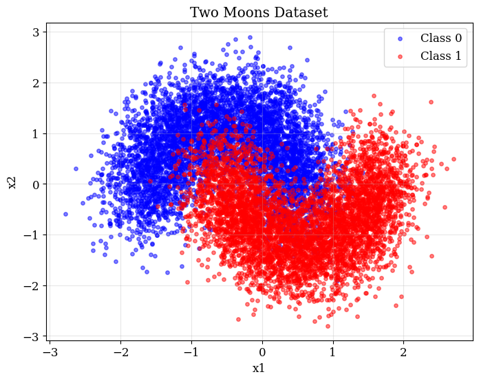
    


```python
def canonicalize_variant_name(name):
    return name.lower().strip().replace(' ', '_')


def make_variant_predict_fn(la_variant, batch_size=256):
    def predict_fn(X_np):
        x_tensor = torch.tensor(X_np, dtype=torch.float32)
        outputs = []
        with torch.no_grad():
            for i in range(0, len(x_tensor), batch_size):
                batch = x_tensor[i:i + batch_size].to(device)
                probs = la_variant(batch, pred_type='glm', link_approx='probit')
                outputs.append(probs[:, 1].detach().cpu())
        return torch.cat(outputs).numpy()
    return predict_fn


def build_laplace_variant(base_model, subset_of_weights, hessian_structure):
    variant_model = TinyMLP(hidden=64).to(device)
    variant_model.load_state_dict(base_model.state_dict())
    return Laplace(
        variant_model,
        'classification',
        subset_of_weights=subset_of_weights,
        hessian_structure=hessian_structure,
    )


def fit_or_load_variant(spec):
    variant_name = spec['variant_name']
    checkpoint_path = os.path.join(checkpoint_dir, f"two_moons_{variant_name}_seed{SEED}.pt")
    if checkpoint_exists(checkpoint_path):
        payload = load_checkpoint(checkpoint_path)
        if isinstance(payload, dict) and payload.get('la') is not None:
            return payload.get('la'), payload.get('metrics', {}), checkpoint_path, True
        if isinstance(payload, dict) and payload.get('la_state_dict') is not None:
            la_variant = build_laplace_variant(model, spec['subset_of_weights'], spec['hessian_structure'])
            la_variant.fit(train_loader)
            la_variant.load_state_dict(payload['la_state_dict'])
            save_checkpoint({'la': la_variant, 'la_state_dict': la_variant.state_dict(), 'metrics': payload.get('metrics', {})}, checkpoint_path)
            return la_variant, payload.get('metrics', {}), checkpoint_path, True

    la_variant = build_laplace_variant(model, spec['subset_of_weights'], spec['hessian_structure'])

    fit_start = time.time()
    la_variant.fit(train_loader)
    variant_metrics = {
        'Fit_Time (s)': time.time() - fit_start,
        'Subset_Of_Weights': spec['subset_of_weights'],
        'Hessian_Structure': spec['hessian_structure'],
        'Tune_Method': spec['tune_method'],
    }

    tune_start = time.time()
    if spec['tune_method'] == 'gridsearch':
        la_variant.optimize_prior_precision(
            method='gridsearch',
            pred_type='glm',
            link_approx='probit',
            val_loader=val_loader,
        )
    else:
        la_variant.optimize_prior_precision(method='marglik')
    variant_metrics['Tune_Time (s)'] = time.time() - tune_start
    variant_metrics['Prior_Precision'] = float(la_variant.prior_precision.item())

    save_checkpoint({'la': la_variant, 'la_state_dict': la_variant.state_dict(), 'metrics': variant_metrics}, checkpoint_path)
    return la_variant, variant_metrics, checkpoint_path, False


variant_specs = [
    {
        'variant_name': 'gridsearch_diag_all_weights',
        'subset_of_weights': 'all',
        'hessian_structure': 'diag',
        'tune_method': 'gridsearch',
        'plot_title': 'Diag / all weights / gridsearch',
    },
    {
        'variant_name': 'marglik_diag_all_weights',
        'subset_of_weights': 'all',
        'hessian_structure': 'diag',
        'tune_method': 'marglik',
        'plot_title': 'Diag / all weights / marglik',
    },
    {
        'variant_name': 'gridsearch_full_all_weights',
        'subset_of_weights': 'all',
        'hessian_structure': 'full',
        'tune_method': 'gridsearch',
        'plot_title': 'Full / all weights / gridsearch',
    },
    {
        'variant_name': 'marglik_full_all_weights',
        'subset_of_weights': 'all',
        'hessian_structure': 'full',
        'tune_method': 'marglik',
        'plot_title': 'Full / all weights / marglik',
    },
    {
        'variant_name': 'gridsearch_kron_all_weights',
        'subset_of_weights': 'all',
        'hessian_structure': 'kron',
        'tune_method': 'gridsearch',
        'plot_title': 'Kron / all weights / gridsearch',
    },
    {
        'variant_name': 'marglik_kron_all_weights',
        'subset_of_weights': 'all',
        'hessian_structure': 'kron',
        'tune_method': 'marglik',
        'plot_title': 'Kron / all weights / marglik',
    },
    {
        'variant_name': 'gridsearch_full_last_layer',
        'subset_of_weights': 'last_layer',
        'hessian_structure': 'full',
        'tune_method': 'gridsearch',
        'plot_title': 'Full / last layer / gridsearch',
    },
    {
        'variant_name': 'marglik_full_last_layer',
        'subset_of_weights': 'last_layer',
        'hessian_structure': 'full',
        'tune_method': 'marglik',
        'plot_title': 'Full / last layer / marglik',
    },
    {
        'variant_name': 'gridsearch_kron_last_layer',
        'subset_of_weights': 'last_layer',
        'hessian_structure': 'kron',
        'tune_method': 'gridsearch',
        'plot_title': 'Kron / last layer / gridsearch',
    },
    {
        'variant_name': 'marglik_kron_last_layer',
        'subset_of_weights': 'last_layer',
        'hessian_structure': 'kron',
        'tune_method': 'marglik',
        'plot_title': 'Kron / last layer / marglik',
    },
]

variant_metrics_records = []
variant_dashboards = {}
variant_results = {}
variant_eval_rows = []
print('Configured variant registry for checkpoint-driven per-variant evaluation.')

```

    Configured variant registry for checkpoint-driven per-variant evaluation.


```python
# Run all Laplace variants -> build variant_eval_df
import pandas as pd
from shared.two_moons_utils import standard_metrics

variant_eval_rows = []
for spec in variant_specs:
    vname = spec["variant_name"]
    print(f"  Evaluating: {vname}")
    la_v, v_metrics, ckpt_path, from_cache = fit_or_load_variant(spec)

    inf_start = time.time()
    with torch.no_grad():
        v_test_probs = la_v(
            X_test_tensor, pred_type="glm", link_approx="probit"
        ).detach().cpu().numpy()  # (N_test, 2)
    v_metrics["Inf_Time (s)"] = time.time() - inf_start

    row = {**v_metrics, **standard_metrics(v_test_probs, y_test_np)}
    variant_eval_rows.append(row)
    variant_results[vname] = {"la": la_v, "probs": v_test_probs, "metrics": row}

variant_eval_df = pd.DataFrame(
    variant_eval_rows,
    index=[s["plot_title"] for s in variant_specs]
)
variant_eval_df.index.name = "Variant"
print(f"\nEvaluated {len(variant_eval_rows)} variants.")

```

      Evaluating: gridsearch_diag_all_weights
      Evaluating: marglik_diag_all_weights
      Evaluating: gridsearch_full_all_weights


    /u/halle/carg/home_at/anaconda3/envs/bnn/lib/python3.12/site-packages/laplace/baselaplace.py:435: UserWarning: By default `link_approx` is `probit`. Make sure to set it equals to the way you want to call `la(test_data, pred_type=..., link_approx=...)`.
      warnings.warn(


      Evaluating: marglik_full_all_weights
      Evaluating: gridsearch_kron_all_weights
      Evaluating: marglik_kron_all_weights
      Evaluating: gridsearch_full_last_layer
      Evaluating: marglik_full_last_layer
      Evaluating: gridsearch_kron_last_layer
      Evaluating: marglik_kron_last_layer
    
    Evaluated 10 variants.


```python
# Per-variant figures: 4 types x 10 configs = 40 figures
# Types: decision boundary, uncertainty heatmap, probability histogram, reliability diagram.
for spec in variant_specs:
    vname = spec["variant_name"]
    title = spec["plot_title"]
    res = variant_results[vname]
    la_v = res["la"]
    test_probs = res["probs"]            # (N_test, 2)

    # 1) Decision boundary
    fig, ax = plt.subplots(1, 1, figsize=(8, 6))
    plot_boundary(lambda X: la_predict(X, la_v), X_train, y_train,
                  f"{title} -- Decision Boundary", ax=ax)
    fig.savefig(os.path.join(FIGURES_DIR, f"{vname}_boundary.png"), dpi=150, bbox_inches="tight")
    plt.show()

    # 2) Uncertainty heatmap
    fig, ax = plt.subplots(1, 1, figsize=(8, 6))
    uncertainty_map(lambda X: la_predict(X, la_v), X_train, y_train,
                    f"{title} -- Uncertainty Map", ax=ax)
    fig.savefig(os.path.join(FIGURES_DIR, f"{vname}_uncertainty.png"), dpi=150, bbox_inches="tight")
    plt.show()

    # 3) Predicted-probability histogram (test set)
    fig, ax = plt.subplots(1, 1, figsize=(10, 6))
    probs_max = test_probs.max(axis=1)
    acc = float((test_probs.argmax(axis=1) == y_test_np).mean())
    mean_conf = float(probs_max.mean())
    ax.hist(probs_max, bins=50, edgecolor="black", alpha=0.7, color="steelblue")
    ax.axvline(x=acc, color="red", linestyle="--", linewidth=2, label=f"Accuracy: {acc:.3f}")
    ax.axvline(x=mean_conf, color="green", linestyle=":", linewidth=2, label=f"Mean Confidence: {mean_conf:.3f}")
    ax.set_xlabel("Predicted Probability (Max Class Prob)")
    ax.set_ylabel("Count")
    ax.set_title(f"{title} -- Predicted Probability Distribution")
    ax.legend()
    ax.grid(True, alpha=0.3)
    fig.savefig(os.path.join(FIGURES_DIR, f"{vname}_histogram.png"), dpi=150, bbox_inches="tight")
    plt.show()

    # 4) Reliability diagram (test set)
    fig, ax = plt.subplots(1, 1, figsize=(8, 6))
    plot_reliability(y_test_np, test_probs, ax, f"{title} -- Reliability Diagram")
    fig.savefig(os.path.join(FIGURES_DIR, f"{vname}_reliability.png"), dpi=150, bbox_inches="tight")
    plt.show()

    print(f"  Saved 4 figures for: {vname}")

print(f"\nDone: {len(variant_specs) * 4} figures written to {FIGURES_DIR}")

```


    
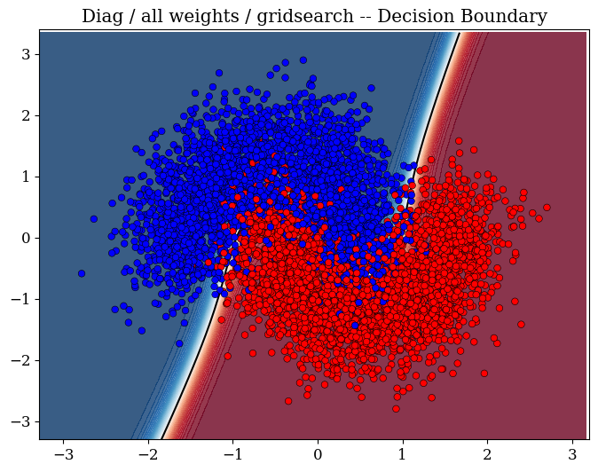
    


    

    


    

    


    
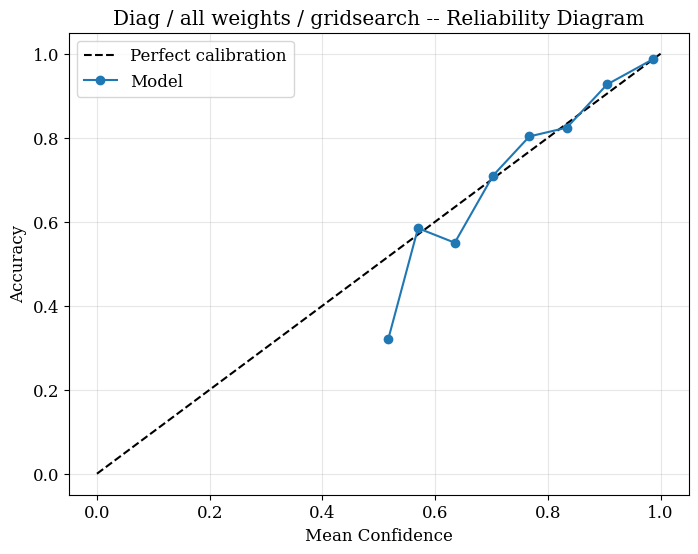
    


      Saved 4 figures for: gridsearch_diag_all_weights


    
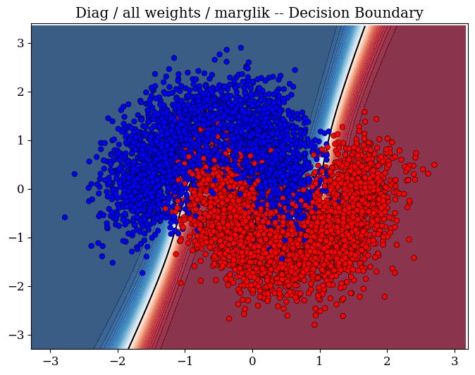
    


    

    


    
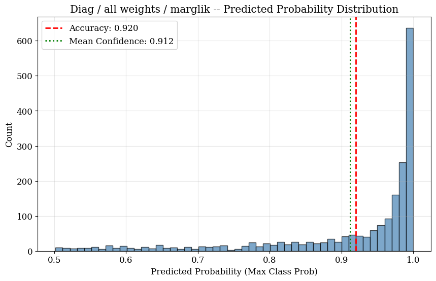
    


    
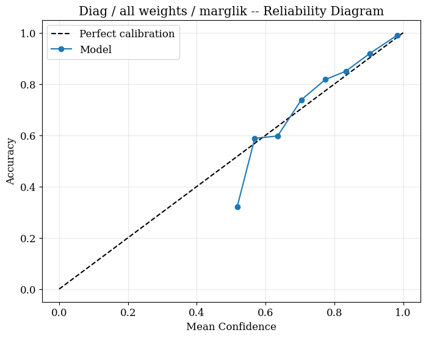
    


      Saved 4 figures for: marglik_diag_all_weights


    

    


    
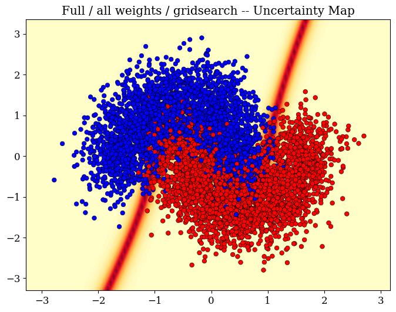
    


    

    


    

    


      Saved 4 figures for: gridsearch_full_all_weights


    
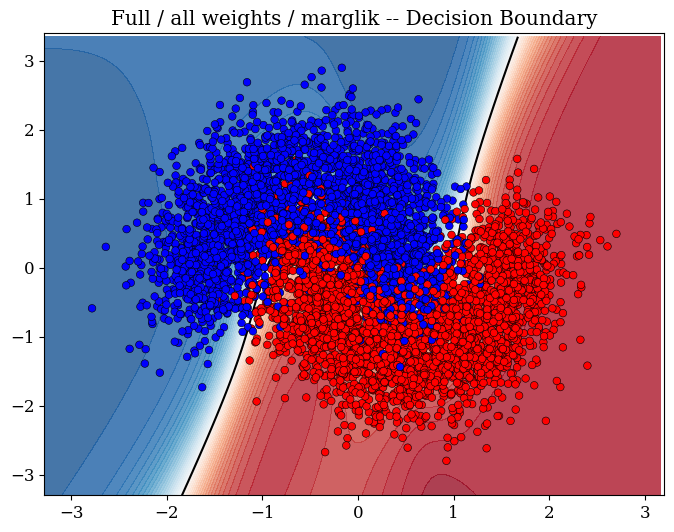
    


    
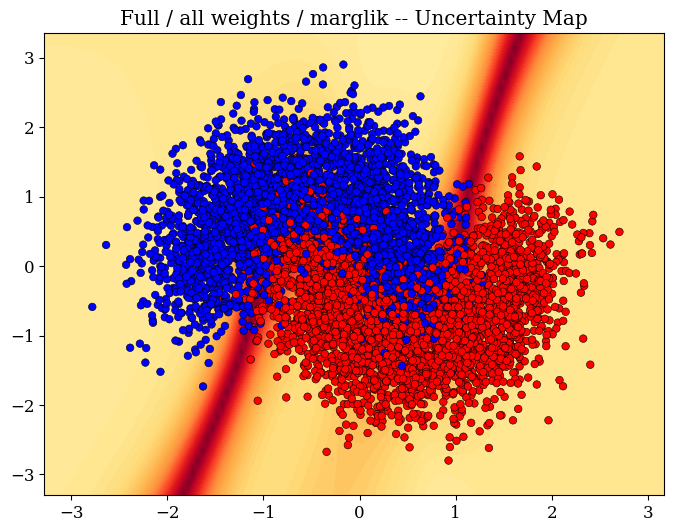
    


    
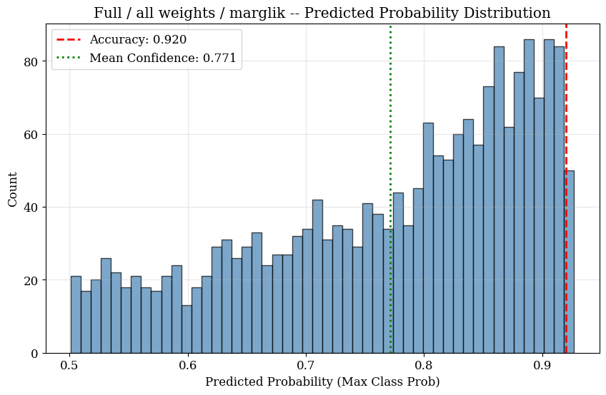
    


    
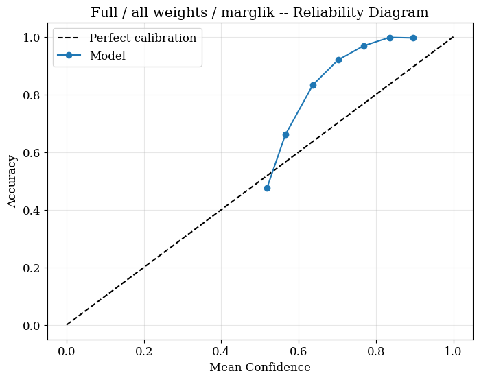
    


      Saved 4 figures for: marglik_full_all_weights


    

    


    
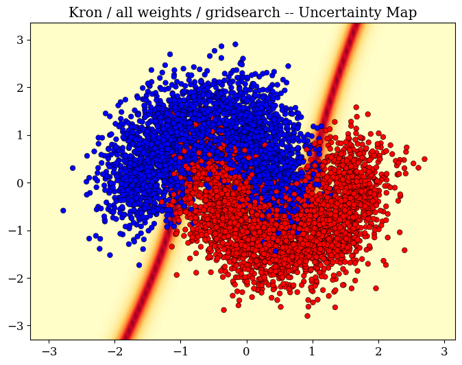
    


    

    


    

    


      Saved 4 figures for: gridsearch_kron_all_weights


    
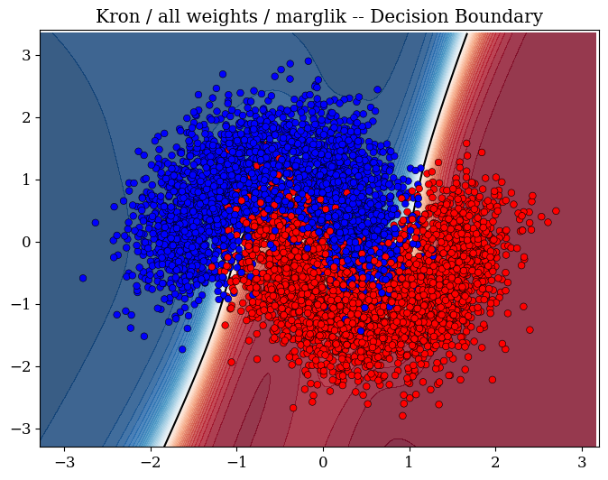
    


    
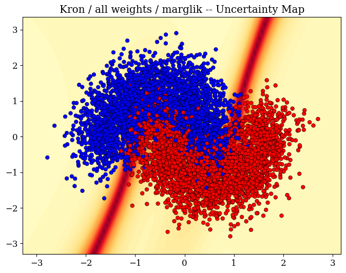
    


    
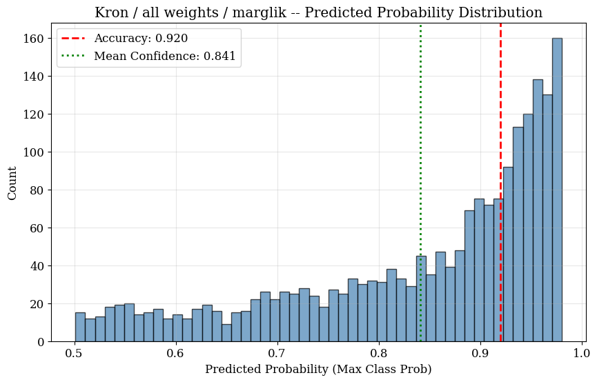
    


    
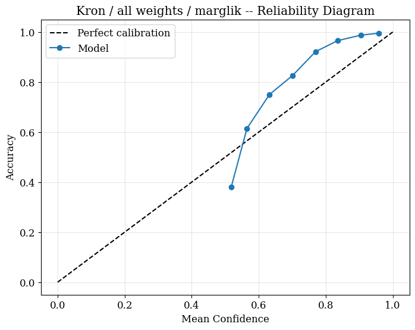
    


      Saved 4 figures for: marglik_kron_all_weights


    

    


    

    


    
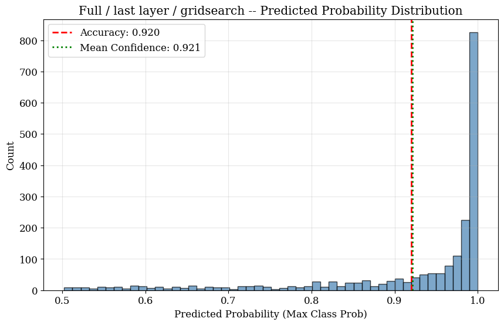
    


    
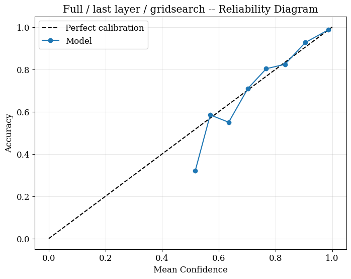
    


      Saved 4 figures for: gridsearch_full_last_layer


    

    


    
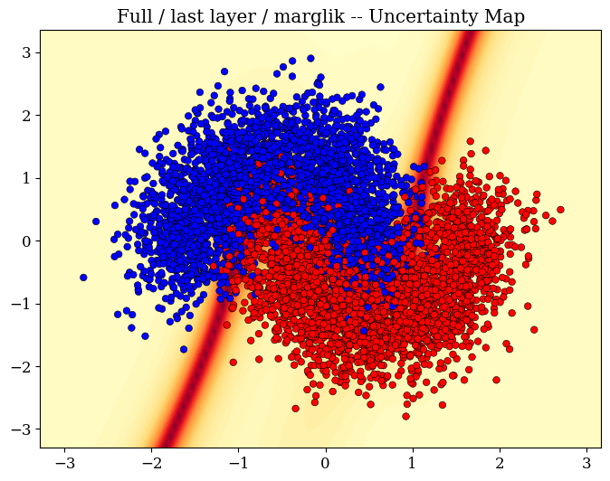
    


    
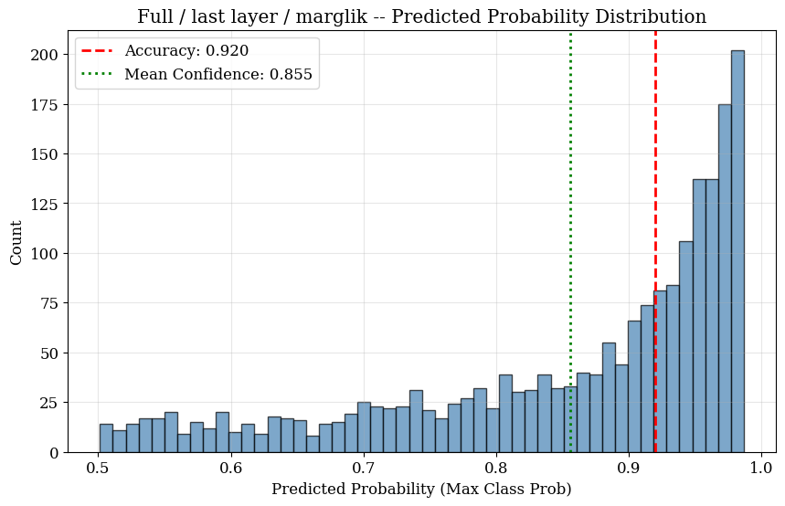
    


    
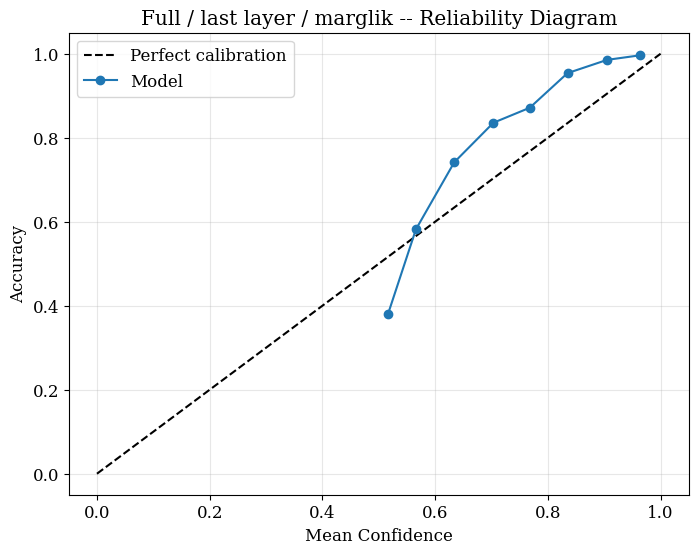
    


      Saved 4 figures for: marglik_full_last_layer


    

    


    

    


    

    


    

    


      Saved 4 figures for: gridsearch_kron_last_layer


    

    


    

    


    
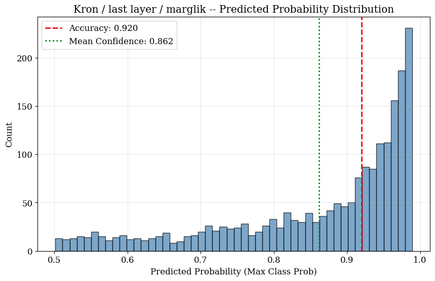
    


    
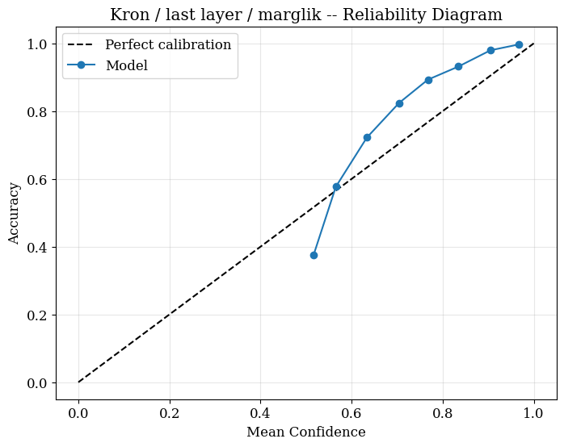
    


      Saved 4 figures for: marglik_kron_last_layer
    
    Done: 40 figures written to ../figures


```python
# Final exhaustive metrics table
variant_table = variant_eval_df.copy()
variant_table.index.name = 'Model Type'

# Keep a stable column order and include the most useful metrics up front.
preferred_cols = [
    'Subset_Of_Weights',
    'Hessian_Structure',
    'Tune_Method',
    'Fit_Time (s)',
    'Tune_Time (s)',
    'Inf_Time (s)',
    'Prior_Precision',
    'Accuracy',
    'NLL',
    'Brier_Score',
    'ECE',
    'Mean_Confidence',
    'Mean_Entropy',
    '1 - Confidence',
    'ExpectedVsActual_Uncertainty_MAE',
    'ExpectedVsActual_Uncertainty_MSE',
    'ExpectedVsActual_Uncertainty_Corr',
    'Max_Binned_Uncertainty_Gap',
]
existing_cols = [col for col in preferred_cols if col in variant_table.columns]
remaining_cols = [col for col in variant_table.columns if col not in existing_cols]
variant_table = variant_table[existing_cols + remaining_cols]

variant_display = variant_table.copy()
for col in variant_display.columns:
    if pd.api.types.is_float_dtype(variant_display[col]):
        variant_display[col] = variant_display[col].map(lambda x: f"{x:.4f}" if pd.notna(x) else '-')
    elif pd.api.types.is_integer_dtype(variant_display[col]):
        variant_display[col] = variant_display[col].map(lambda x: str(x) if pd.notna(x) else '-')
    elif pd.api.types.is_bool_dtype(variant_display[col]):
        variant_display[col] = variant_display[col].map(lambda x: 'true' if bool(x) else 'false')

print('Two Moons Variant-Level Calibration and Uncertainty Benchmarks')
display(variant_display)

os.makedirs('results/metrics', exist_ok=True)
variant_csv_path = 'results/metrics/two_moons_variant_metrics.csv'
variant_table.to_csv(variant_csv_path)
print(f'\nSaved metrics to {variant_csv_path}')

# Backward-compatible export at the notebook root.
legacy_csv_path = 'twomoons_bnn_comparison_metrics.csv'
variant_table.to_csv(legacy_csv_path)
print(f'Saved metrics to {legacy_csv_path}')

```

    Two Moons Variant-Level Calibration and Uncertainty Benchmarks


<div>
<style scoped>
    .dataframe tbody tr th:only-of-type {
        vertical-align: middle;
    }

    .dataframe tbody tr th {
        vertical-align: top;
    }

    .dataframe thead th {
        text-align: right;
    }
</style>
<table border="1" class="dataframe">
  <thead>
    <tr style="text-align: right;">
      <th></th>
      <th>Subset_Of_Weights</th>
      <th>Hessian_Structure</th>
      <th>Tune_Method</th>
      <th>Fit_Time (s)</th>
      <th>Tune_Time (s)</th>
      <th>Inf_Time (s)</th>
      <th>Prior_Precision</th>
      <th>Accuracy</th>
      <th>NLL</th>
      <th>Brier_Score</th>
      <th>ECE</th>
      <th>Mean_Confidence</th>
      <th>Mean_Entropy</th>
      <th>1 - Confidence</th>
      <th>ExpectedVsActual_Uncertainty_MAE</th>
      <th>ExpectedVsActual_Uncertainty_MSE</th>
      <th>ExpectedVsActual_Uncertainty_Corr</th>
      <th>Max_Binned_Uncertainty_Gap</th>
      <th>Classwise_ECE</th>
      <th>Mean_Actual_Error</th>
    </tr>
    <tr>
      <th>Model Type</th>
      <th></th>
      <th></th>
      <th></th>
      <th></th>
      <th></th>
      <th></th>
      <th></th>
      <th></th>
      <th></th>
      <th></th>
      <th></th>
      <th></th>
      <th></th>
      <th></th>
      <th></th>
      <th></th>
      <th></th>
      <th></th>
      <th></th>
      <th></th>
    </tr>
  </thead>
  <tbody>
    <tr>
      <th>Diag / all weights / gridsearch</th>
      <td>all</td>
      <td>diag</td>
      <td>gridsearch</td>
      <td>0.2327</td>
      <td>4.0132</td>
      <td>0.0209</td>
      <td>10000.0000</td>
      <td>0.9200</td>
      <td>0.1898</td>
      <td>0.0564</td>
      <td>0.0101</td>
      <td>0.9213</td>
      <td>0.1945</td>
      <td>0.0787</td>
      <td>0.0101</td>
      <td>0.0008</td>
      <td>0.9590</td>
      <td>0.1967</td>
      <td>0.0101</td>
      <td>0.0800</td>
    </tr>
    <tr>
      <th>Diag / all weights / marglik</th>
      <td>all</td>
      <td>diag</td>
      <td>marglik</td>
      <td>0.1971</td>
      <td>0.0563</td>
      <td>0.0208</td>
      <td>8.7298</td>
      <td>0.9200</td>
      <td>0.1921</td>
      <td>0.0567</td>
      <td>0.0159</td>
      <td>0.9121</td>
      <td>0.2190</td>
      <td>0.0879</td>
      <td>0.0159</td>
      <td>0.0008</td>
      <td>0.9548</td>
      <td>0.1961</td>
      <td>0.0159</td>
      <td>0.0800</td>
    </tr>
    <tr>
      <th>Full / all weights / gridsearch</th>
      <td>all</td>
      <td>full</td>
      <td>gridsearch</td>
      <td>1262.9692</td>
      <td>11.4233</td>
      <td>0.0340</td>
      <td>10000.0000</td>
      <td>0.9200</td>
      <td>0.1898</td>
      <td>0.0564</td>
      <td>0.0101</td>
      <td>0.9213</td>
      <td>0.1944</td>
      <td>0.0787</td>
      <td>0.0101</td>
      <td>0.0008</td>
      <td>0.9590</td>
      <td>0.1967</td>
      <td>0.0101</td>
      <td>0.0800</td>
    </tr>
    <tr>
      <th>Full / all weights / marglik</th>
      <td>all</td>
      <td>full</td>
      <td>marglik</td>
      <td>1122.3712</td>
      <td>1.8827</td>
      <td>0.0339</td>
      <td>0.5189</td>
      <td>0.9200</td>
      <td>0.3071</td>
      <td>0.0823</td>
      <td>0.1523</td>
      <td>0.7711</td>
      <td>0.4997</td>
      <td>0.2289</td>
      <td>0.1523</td>
      <td>0.0257</td>
      <td>0.9134</td>
      <td>0.2180</td>
      <td>0.1523</td>
      <td>0.0800</td>
    </tr>
    <tr>
      <th>Kron / all weights / gridsearch</th>
      <td>all</td>
      <td>kron</td>
      <td>gridsearch</td>
      <td>0.5417</td>
      <td>5.2935</td>
      <td>0.0220</td>
      <td>10000.0000</td>
      <td>0.9200</td>
      <td>0.1898</td>
      <td>0.0564</td>
      <td>0.0101</td>
      <td>0.9213</td>
      <td>0.1944</td>
      <td>0.0787</td>
      <td>0.0101</td>
      <td>0.0008</td>
      <td>0.9590</td>
      <td>0.1967</td>
      <td>0.0101</td>
      <td>0.0800</td>
    </tr>
    <tr>
      <th>Kron / all weights / marglik</th>
      <td>all</td>
      <td>kron</td>
      <td>marglik</td>
      <td>0.5312</td>
      <td>0.0964</td>
      <td>0.0218</td>
      <td>1.4195</td>
      <td>0.9200</td>
      <td>0.2380</td>
      <td>0.0647</td>
      <td>0.0855</td>
      <td>0.8414</td>
      <td>0.3773</td>
      <td>0.1586</td>
      <td>0.0855</td>
      <td>0.0091</td>
      <td>0.9228</td>
      <td>0.1518</td>
      <td>0.0855</td>
      <td>0.0800</td>
    </tr>
    <tr>
      <th>Full / last layer / gridsearch</th>
      <td>last_layer</td>
      <td>full</td>
      <td>gridsearch</td>
      <td>7.1220</td>
      <td>1.5203</td>
      <td>0.0008</td>
      <td>10000.0000</td>
      <td>0.9200</td>
      <td>0.1898</td>
      <td>0.0564</td>
      <td>0.0101</td>
      <td>0.9213</td>
      <td>0.1944</td>
      <td>0.0787</td>
      <td>0.0101</td>
      <td>0.0008</td>
      <td>0.9590</td>
      <td>0.1967</td>
      <td>0.0101</td>
      <td>0.0800</td>
    </tr>
    <tr>
      <th>Full / last layer / marglik</th>
      <td>last_layer</td>
      <td>full</td>
      <td>marglik</td>
      <td>7.1339</td>
      <td>0.0882</td>
      <td>0.0008</td>
      <td>1.7871</td>
      <td>0.9200</td>
      <td>0.2260</td>
      <td>0.0623</td>
      <td>0.0703</td>
      <td>0.8554</td>
      <td>0.3484</td>
      <td>0.1446</td>
      <td>0.0703</td>
      <td>0.0065</td>
      <td>0.9348</td>
      <td>0.1356</td>
      <td>0.0703</td>
      <td>0.0800</td>
    </tr>
    <tr>
      <th>Kron / last layer / gridsearch</th>
      <td>last_layer</td>
      <td>kron</td>
      <td>gridsearch</td>
      <td>0.4291</td>
      <td>1.8542</td>
      <td>0.0012</td>
      <td>10000.0000</td>
      <td>0.9200</td>
      <td>0.1898</td>
      <td>0.0564</td>
      <td>0.0101</td>
      <td>0.9213</td>
      <td>0.1944</td>
      <td>0.0787</td>
      <td>0.0101</td>
      <td>0.0008</td>
      <td>0.9590</td>
      <td>0.1967</td>
      <td>0.0101</td>
      <td>0.0800</td>
    </tr>
    <tr>
      <th>Kron / last layer / marglik</th>
      <td>last_layer</td>
      <td>kron</td>
      <td>marglik</td>
      <td>0.4382</td>
      <td>0.0761</td>
      <td>0.0006</td>
      <td>2.0368</td>
      <td>0.9200</td>
      <td>0.2208</td>
      <td>0.0613</td>
      <td>0.0637</td>
      <td>0.8619</td>
      <td>0.3344</td>
      <td>0.1381</td>
      <td>0.0637</td>
      <td>0.0055</td>
      <td>0.9378</td>
      <td>0.1414</td>
      <td>0.0637</td>
      <td>0.0800</td>
    </tr>
  </tbody>
</table>
</div>


    
    Saved metrics to results/metrics/two_moons_variant_metrics.csv
    Saved metrics to twomoons_bnn_comparison_metrics.csv


## Out-of-Distribution (OOD) Test

The two-moons training data spans roughly `x1, x2 ∈ [-2.8, 2.9]`. Here we build a
purely synthetic 2D OOD set clustered around the four far corners `(±3, ±3)` and
evaluate every fitted variant on it.

A well-calibrated Bayesian model should be less confident (higher `1 - Confidence`
and higher entropy) on these OOD points than on the in-distribution test set, a
deterministic MAP net typically stays confidently wrong out there.


```python
# Build OOD set: 2D points outside the training distribution
rng = np.random.default_rng(SEED)
ood_corners = np.array([[-3, -3], [3, -3], [-3, 3], [3, 3]], dtype=float)
n_per_corner = 50
X_ood = np.vstack([c + 0.4 * rng.standard_normal((n_per_corner, 2)) for c in ood_corners])
X_ood_tensor = torch.tensor(X_ood, dtype=torch.float32).to(device)
print(f"OOD set: {len(X_ood)} points around corners {ood_corners.tolist()}")

# Sanity scatter: training data vs OOD points
fig, ax = plt.subplots(1, 1, figsize=(8, 6))
ax.scatter(X_train[:, 0], X_train[:, 1], c=y_train, cmap="bwr", s=10, alpha=0.3, edgecolors="none", label="train")
ax.scatter(X_ood[:, 0], X_ood[:, 1], c="black", marker="x", s=40, label="OOD")
ax.set_title("Training data vs OOD probe points")
ax.set_xlabel("x1"); ax.set_ylabel("x2")
ax.legend(); ax.grid(True, alpha=0.3)
fig.savefig(os.path.join(FIGURES_DIR, "ood_points.png"), dpi=150, bbox_inches="tight")
plt.show()
```

    OOD set: 200 points around corners [[-3.0, -3.0], [3.0, -3.0], [-3.0, 3.0], [3.0, 3.0]]


    

    


```python
#ID vs OOD uncertainty per variant (epistemic/aleatoric decomposition)
def _entropy(p):
    return -(p * np.log(p + 1e-12)).sum(axis=-1)

def predictive_uncertainties(la_v, X_t, n_samples=100, batch_size=256):
    """Per-point (confidence, total, aleatoric, epistemic) via posterior sampling.
    Batched so the GLM Jacobian never blows up GPU memory.
    epistemic = mutual information = H[E_θ p] - E_θ[H[p]]."""
    parts = []
    with torch.no_grad():
        for i in range(0, len(X_t), batch_size):
            s = la_v.predictive_samples(X_t[i:i+batch_size], pred_type="glm", n_samples=n_samples)
            parts.append(s.detach().cpu().numpy())     # (S, b, C) -> CPU, frees GPU
            if X_t.is_cuda:
                torch.cuda.empty_cache()
    samples = np.concatenate(parts, axis=1)            # (S, N, C)
    mean_p = samples.mean(axis=0)                       # (N, C)
    total = _entropy(mean_p)                             # (N,)
    aleatoric = _entropy(samples).mean(axis=0)          # (N,)
    epistemic = total - aleatoric                        # (N,)  mutual information
    conf = mean_p.max(axis=1)                            # (N,)
    return conf, total, aleatoric, epistemic

ood_rows = []
for spec in variant_specs:
    vname = spec["variant_name"]
    la_v = variant_results[vname]["la"]

    id_conf,  _, id_alea,  id_epi  = predictive_uncertainties(la_v, X_test_tensor)
    ood_conf, _, ood_alea, ood_epi = predictive_uncertainties(la_v, X_ood_tensor)

    ood_rows.append({
        "ID 1 - Confidence":   float((1 - id_conf).mean()),
        "OOD 1 - Confidence":  float((1 - ood_conf).mean()),
        "ID Aleatoric":        float(id_alea.mean()),
        "OOD Aleatoric":       float(ood_alea.mean()),
        "ID Epistemic":        float(id_epi.mean()),
        "OOD Epistemic":       float(ood_epi.mean()),
        "Δ Epistemic (OOD-ID)": float(ood_epi.mean() - id_epi.mean()),
    })

ood_df = pd.DataFrame(ood_rows, index=[s["plot_title"] for s in variant_specs])
ood_df.index.name = "Variant"
print("ID vs OOD: Epistemic should be higher on OOD (Δ Epistemic > 0)")
display(ood_df.round(4))

os.makedirs("results/metrics", exist_ok=True)
ood_df.to_csv("results/metrics/two_moons_ood_metrics.csv")
print("\nSaved OOD metrics to results/metrics/two_moons_ood_metrics.csv")
```

    ID vs OOD: Epistemic should be higher on OOD (Δ Epistemic > 0)


<div>
<style scoped>
    .dataframe tbody tr th:only-of-type {
        vertical-align: middle;
    }

    .dataframe tbody tr th {
        vertical-align: top;
    }

    .dataframe thead th {
        text-align: right;
    }
</style>
<table border="1" class="dataframe">
  <thead>
    <tr style="text-align: right;">
      <th></th>
      <th>ID 1 - Confidence</th>
      <th>OOD 1 - Confidence</th>
      <th>ID Aleatoric</th>
      <th>OOD Aleatoric</th>
      <th>ID Epistemic</th>
      <th>OOD Epistemic</th>
      <th>Δ Epistemic (OOD-ID)</th>
    </tr>
    <tr>
      <th>Variant</th>
      <th></th>
      <th></th>
      <th></th>
      <th></th>
      <th></th>
      <th></th>
      <th></th>
    </tr>
  </thead>
  <tbody>
    <tr>
      <th>Diag / all weights / gridsearch</th>
      <td>0.0788</td>
      <td>0.0004</td>
      <td>0.1944</td>
      <td>0.0031</td>
      <td>0.0002</td>
      <td>0.0000</td>
      <td>-0.0002</td>
    </tr>
    <tr>
      <th>Diag / all weights / marglik</th>
      <td>0.1073</td>
      <td>0.0016</td>
      <td>0.2069</td>
      <td>0.0055</td>
      <td>0.0551</td>
      <td>0.0019</td>
      <td>-0.0532</td>
    </tr>
    <tr>
      <th>Full / all weights / gridsearch</th>
      <td>0.0788</td>
      <td>0.0004</td>
      <td>0.1944</td>
      <td>0.0031</td>
      <td>0.0001</td>
      <td>0.0000</td>
      <td>-0.0001</td>
    </tr>
    <tr>
      <th>Full / all weights / marglik</th>
      <td>0.0814</td>
      <td>0.0100</td>
      <td>0.1998</td>
      <td>0.0248</td>
      <td>0.0043</td>
      <td>0.0220</td>
      <td>0.0177</td>
    </tr>
    <tr>
      <th>Kron / all weights / gridsearch</th>
      <td>0.0788</td>
      <td>0.0004</td>
      <td>0.1944</td>
      <td>0.0031</td>
      <td>0.0002</td>
      <td>0.0000</td>
      <td>-0.0002</td>
    </tr>
    <tr>
      <th>Kron / all weights / marglik</th>
      <td>0.0827</td>
      <td>0.0017</td>
      <td>0.1987</td>
      <td>0.0057</td>
      <td>0.0067</td>
      <td>0.0021</td>
      <td>-0.0045</td>
    </tr>
    <tr>
      <th>Full / last layer / gridsearch</th>
      <td>0.0787</td>
      <td>0.0004</td>
      <td>0.1943</td>
      <td>0.0030</td>
      <td>0.0001</td>
      <td>0.0000</td>
      <td>-0.0001</td>
    </tr>
    <tr>
      <th>Full / last layer / marglik</th>
      <td>0.0792</td>
      <td>0.0005</td>
      <td>0.1952</td>
      <td>0.0036</td>
      <td>0.0008</td>
      <td>0.0001</td>
      <td>-0.0007</td>
    </tr>
    <tr>
      <th>Kron / last layer / gridsearch</th>
      <td>0.0787</td>
      <td>0.0004</td>
      <td>0.1943</td>
      <td>0.0030</td>
      <td>0.0001</td>
      <td>0.0000</td>
      <td>-0.0001</td>
    </tr>
    <tr>
      <th>Kron / last layer / marglik</th>
      <td>0.0791</td>
      <td>0.0004</td>
      <td>0.1945</td>
      <td>0.0031</td>
      <td>0.0008</td>
      <td>0.0000</td>
      <td>-0.0008</td>
    </tr>
  </tbody>
</table>
</div>


    
    Saved OOD metrics to results/metrics/two_moons_ood_metrics.csv


```python
# Per-variant OOD EPISTEMIC-uncertainty maps (extended grid)
ext = 4.5
gx, gy = np.meshgrid(np.arange(-ext, ext, 0.1), np.arange(-ext, ext, 0.1))
ood_grid_t = torch.tensor(np.c_[gx.ravel(), gy.ravel()], dtype=torch.float32).to(device)

for spec in variant_specs:
    vname = spec["variant_name"]; title = spec["plot_title"]
    la_v = variant_results[vname]["la"]
    _, _, _, epi = predictive_uncertainties(la_v, ood_grid_t, n_samples=50)
    epi_grid = epi.reshape(gx.shape)

    fig, ax = plt.subplots(1, 1, figsize=(8, 7))
    cf = ax.contourf(gx, gy, epi_grid, levels=50, cmap="YlOrRd")
    ax.scatter(X_train[:, 0], X_train[:, 1], c=y_train, cmap="bwr", s=8, alpha=0.25, edgecolors="none")
    ax.scatter(X_ood[:, 0], X_ood[:, 1], c="black", marker="x", s=40, label="OOD")
    plt.colorbar(cf, ax=ax, label="Epistemic uncertainty (mutual information)")
    ax.set_title(f"{title} -- OOD epistemic uncertainty")
    ax.set_xlabel("x1"); ax.set_ylabel("x2")
    ax.legend(loc="upper left")
    fig.savefig(os.path.join(FIGURES_DIR, f"{vname}_ood_epistemic.png"), dpi=150, bbox_inches="tight")
    plt.show()
    print(f"  Saved OOD epistemic map for: {vname}")

print(f"\nDone: {len(variant_specs)} OOD epistemic maps written to {FIGURES_DIR}")
```


    
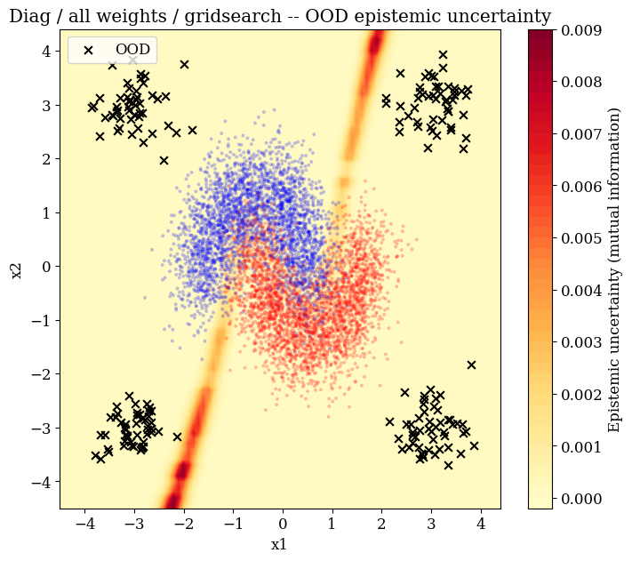
    


      Saved OOD epistemic map for: gridsearch_diag_all_weights


    
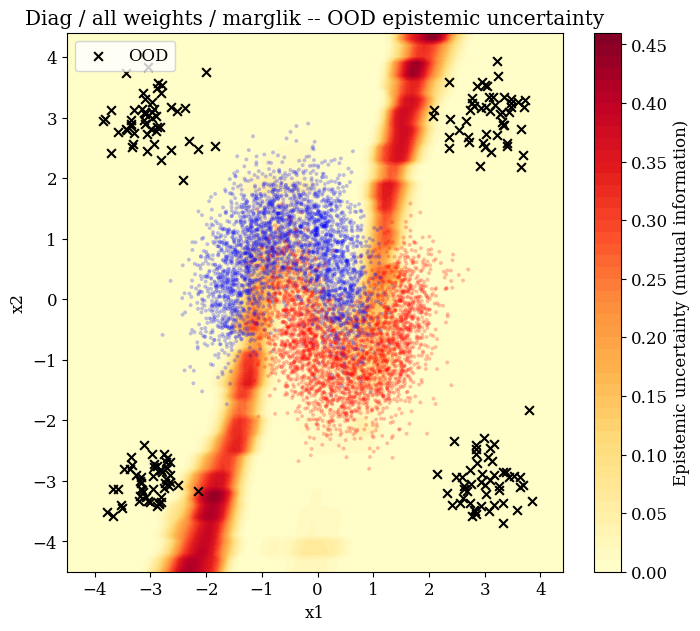
    


      Saved OOD epistemic map for: marglik_diag_all_weights


    

    


      Saved OOD epistemic map for: gridsearch_full_all_weights


    
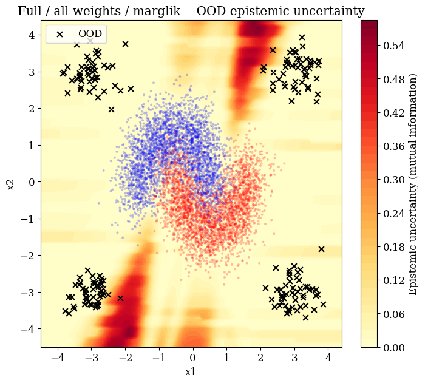
    


      Saved OOD epistemic map for: marglik_full_all_weights


    
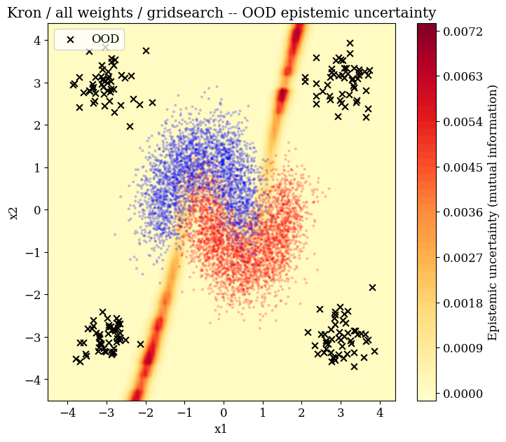
    


      Saved OOD epistemic map for: gridsearch_kron_all_weights


    
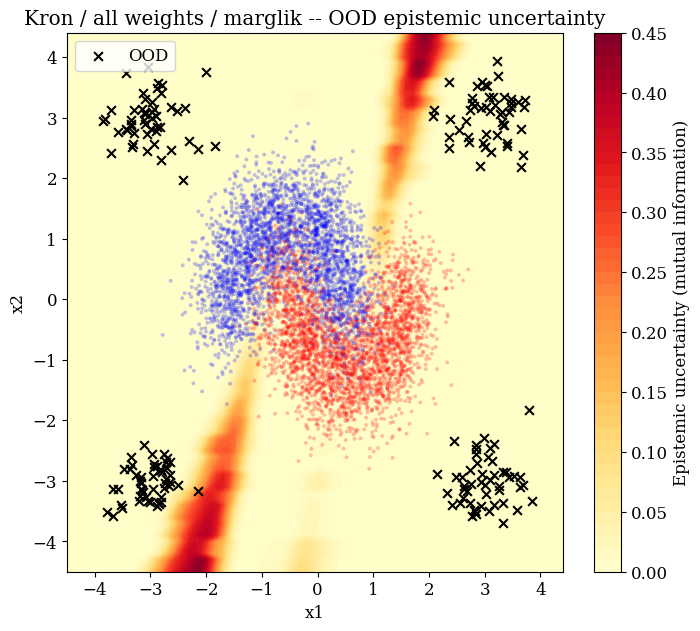
    


      Saved OOD epistemic map for: marglik_kron_all_weights


    
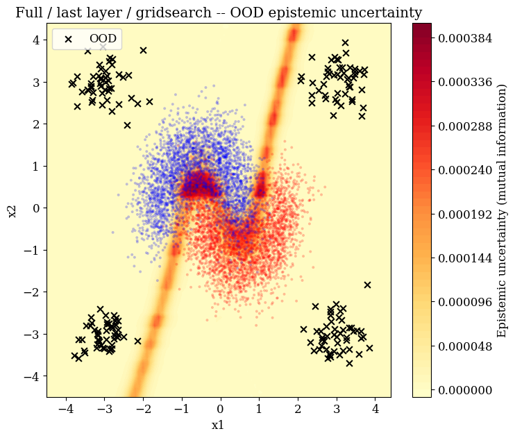
    


      Saved OOD epistemic map for: gridsearch_full_last_layer


    

    


      Saved OOD epistemic map for: marglik_full_last_layer


    
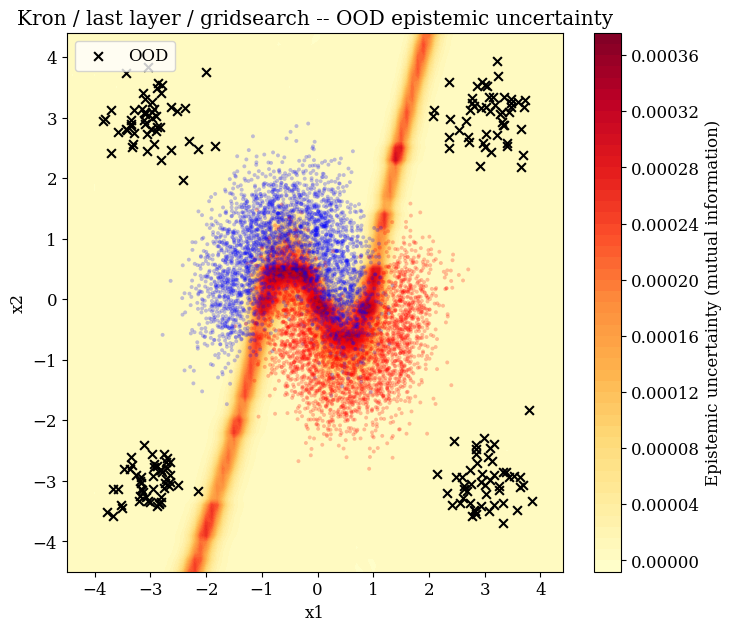
    


      Saved OOD epistemic map for: gridsearch_kron_last_layer


    
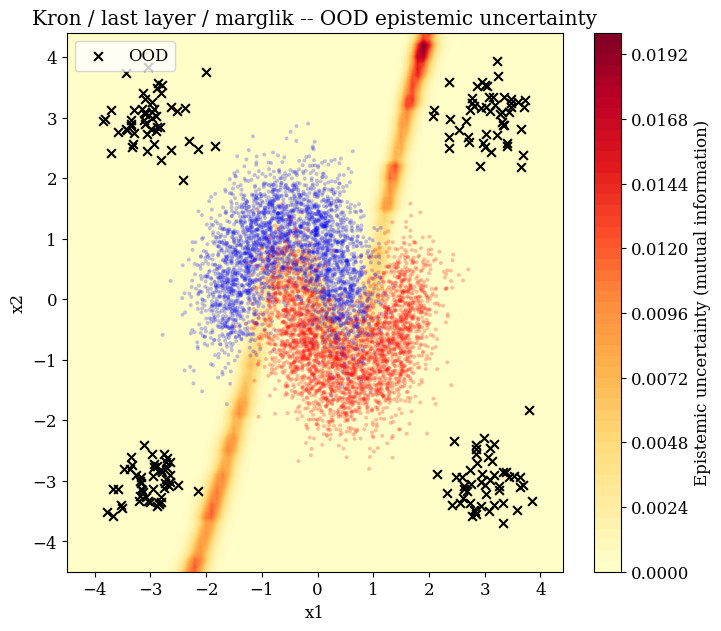
    


      Saved OOD epistemic map for: marglik_kron_last_layer
    
    Done: 10 OOD epistemic maps written to ../figures

