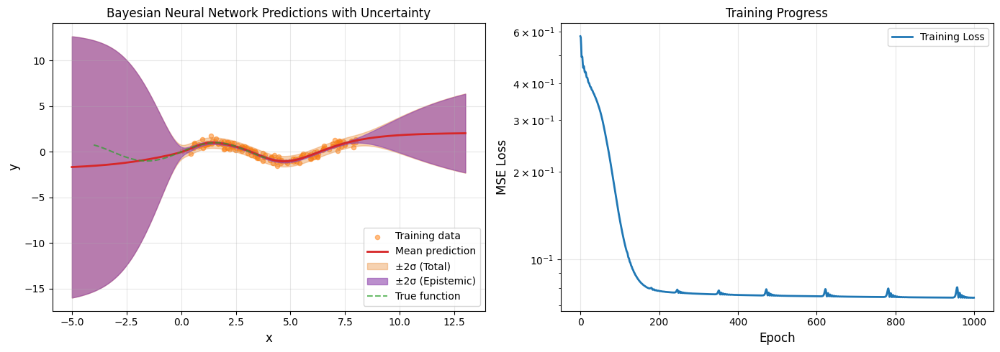
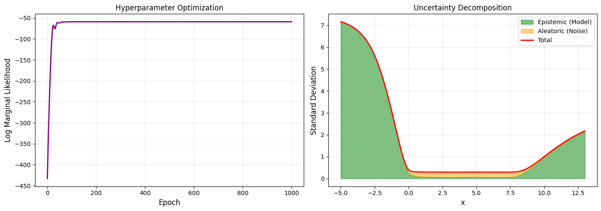
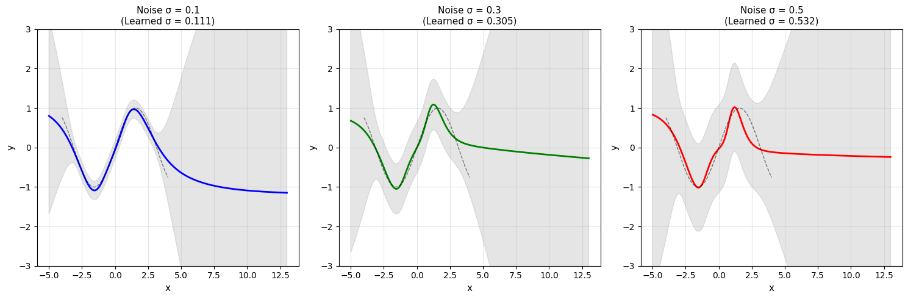

# Bayesian Neural Network with Laplace Approximation

This notebook demonstrates Bayesian inference on neural networks using Laplace approximation. We'll train a neural network on sinusoidal regression data and use Laplace approximation to quantify uncertainty in predictions.

## 1. Import Required Libraries


```python
import numpy as np
import torch
import matplotlib.pyplot as plt
import matplotlib.patches as mpatches
from matplotlib.patches import Patch

from laplace import Laplace, marglik_training
from laplace.curvature.backpack import BackPackGGN

try:
    from shared.helper.dataloaders import get_sinusoid_example
    from shared.helper.util import plot_regression
    HELPERS_AVAILABLE = True
except ImportError:
    print("Warning: helper modules not available. Will define alternatives.")
    HELPERS_AVAILABLE = False

np.random.seed(711)
torch.manual_seed(711)


```


    <torch._C.Generator at 0x7be7af5faf50>


## 2. Set Up Data and Configuration


```python
# Configuration
n_epochs = 1000
batch_size = 32
sigma_noise = 0.3

# Generate or load data
if HELPERS_AVAILABLE:
    X_train, y_train, train_loader, X_test = get_sinusoid_example(sigma_noise=sigma_noise)
else:
    # Fallback: create sinusoid data manually
    n_train = 100
    X_train = torch.linspace(-3, 3, n_train).unsqueeze(1)
    y_train = torch.sin(X_train) + sigma_noise * torch.randn_like(X_train)
    train_loader = torch.utils.data.DataLoader(
        torch.utils.data.TensorDataset(X_train, y_train),
        batch_size=batch_size,
        shuffle=True
    )
    X_test = torch.linspace(-4, 4, 200).unsqueeze(1)

print(f"Training data shape: {X_train.shape}")
print(f"Test data shape: {X_test.shape}")
print(f"Number of training batches: {len(train_loader)}")


```

    Training data shape: torch.Size([150, 1])
    Test data shape: torch.Size([500, 1])
    Number of training batches: 1


## 3. Implement Core Code: MAP Training and Laplace Approximation

We'll train a neural network using MAP (Maximum A Posteriori) estimation, then fit a Laplace approximation to quantify uncertainty.


```python
# Define model architecture
def get_model():
    torch.manual_seed(711)
    return torch.nn.Sequential(
        torch.nn.Linear(1, 50), 
        torch.nn.Tanh(), 
        torch.nn.Linear(50, 1)
    )

# Train MAP (Maximum A Posteriori)
print("Training MAP model...")
model = get_model()
criterion = torch.nn.MSELoss()
optimizer = torch.optim.Adam(model.parameters(), lr=1e-2)

train_losses = []
for i in range(n_epochs):
    epoch_loss = 0.0
    for X, y in train_loader:
        optimizer.zero_grad()
        loss = criterion(model(X), y)
        loss.backward()
        optimizer.step()
        epoch_loss += loss.item()
    
    epoch_loss /= len(train_loader)
    train_losses.append(epoch_loss)
    
    if (i + 1) % 200 == 0:
        print(f"Epoch {i+1}/{n_epochs}, Loss: {epoch_loss:.4f}")

print("MAP training complete!")


```

    Training MAP model...
    Epoch 200/1000, Loss: 0.0782
    Epoch 400/1000, Loss: 0.0757
    Epoch 600/1000, Loss: 0.0750
    Epoch 800/1000, Loss: 0.0752
    Epoch 1000/1000, Loss: 0.0741
    MAP training complete!


```python
# Fit Laplace approximation
print("Fitting Laplace approximation...")
la = Laplace(model, "regression", subset_of_weights="all", hessian_structure="full")
la.fit(train_loader)

# Optimize hyperparameters using marginal likelihood
print("Optimizing hyperparameters...")
log_prior = torch.ones(1, requires_grad=True)
log_sigma = torch.ones(1, requires_grad=True)
hyper_optimizer = torch.optim.Adam([log_prior, log_sigma], lr=1e-1)

marglik_values = []
for i in range(n_epochs):
    hyper_optimizer.zero_grad()
    neg_marglik = -la.log_marginal_likelihood(log_prior.exp(), log_sigma.exp())
    neg_marglik.backward()
    hyper_optimizer.step()
    marglik_values.append(-neg_marglik.item())
    
    if (i + 1) % 200 == 0:
        print(f"Epoch {i+1}/{n_epochs}, Marginal Likelihood: {-neg_marglik.item():.4f}")

print("Laplace approximation complete!")
print(f"Learned sigma_noise: {la.sigma_noise.item():.4f}")
print(f"Learned prior precision: {la.prior_precision.item():.4f}")


```

    Fitting Laplace approximation...
    Optimizing hyperparameters...
    Epoch 200/1000, Marginal Likelihood: -59.0499
    Epoch 400/1000, Marginal Likelihood: -59.0493
    Epoch 600/1000, Marginal Likelihood: -59.0831
    Epoch 800/1000, Marginal Likelihood: -59.0665
    Epoch 1000/1000, Marginal Likelihood: -59.0743
    Laplace approximation complete!
    Learned sigma_noise: 0.2819
    Learned prior precision: 0.1008


## 4. Run Code and Generate Predictions

Now we'll generate predictions with uncertainty estimates on the test data.


```python
# Generate predictions
print("Generating predictions...")

# Marginal predictive distribution: N(f_map(x_i), var(x_i))
f_mu, f_var = la(X_test)

# Joint predictive distribution: N(f_map, Cov(f))
f_mu_joint, f_cov = la(X_test, joint=True)

# Convert to numpy
x_test_np = X_test.flatten().cpu().numpy()
f_mu_np = f_mu.squeeze().detach().cpu().numpy()
f_var_np = f_var.squeeze().detach().cpu().numpy()
f_sigma_np = np.sqrt(f_var_np)

# Total predictive uncertainty (aleatoric + epistemic)
pred_std = np.sqrt(f_sigma_np**2 + la.sigma_noise.item() ** 2)

# Verify marginal and joint predictions match
assert torch.allclose(f_mu.flatten(), f_mu_joint)
assert torch.allclose(f_var.flatten(), f_cov.diag())
print("✓ Marginal and joint predictions verified!")

# Convert training data to numpy for visualization
X_train_np = X_train.flatten().cpu().numpy()
y_train_np = y_train.flatten().cpu().numpy()

print(f"Test predictions shape: {f_mu_np.shape}")
print(f"Epistemic uncertainty (std): {f_sigma_np.mean():.4f}")
print(f"Aleatoric uncertainty (noise std): {la.sigma_noise.item():.4f}")


```

    Generating predictions...
    ✓ Marginal and joint predictions verified!
    Test predictions shape: (500,)
    Epistemic uncertainty (std): 1.7009
    Aleatoric uncertainty (noise std): 0.2819


## 5. Visualize Results

We'll create comprehensive visualizations showing predictions, uncertainty, and training progress.


```python
# Main regression plot with uncertainty
fig, axes = plt.subplots(1, 2, figsize=(14, 5))

# Plot 1: Regression with uncertainty bands
ax = axes[0]
ax.scatter(X_train_np, y_train_np, color='#ff7f0e', s=20, alpha=0.5, label='Training data')
ax.plot(x_test_np, f_mu_np, color='#d62728', linewidth=2, label='Mean prediction')
ax.fill_between(x_test_np, 
                 f_mu_np - 2*pred_std, 
                 f_mu_np + 2*pred_std, 
                 alpha=0.35, color='#e67e22', label='±2σ (Total)')
ax.fill_between(x_test_np, 
                 f_mu_np - 2*f_sigma_np, 
                 f_mu_np + 2*f_sigma_np, 
                 alpha=0.6, color='#8e44ad', label='±2σ (Epistemic)')

# Plot true function if available
x_dense = np.linspace(-4, 4, 500)
y_true = np.sin(x_dense)
ax.plot(x_dense, y_true, color='#2ca02c', linestyle='--', linewidth=1.5, alpha=0.7, label='True function')

ax.set_xlabel('x', fontsize=12)
ax.set_ylabel('y', fontsize=12)
ax.set_title('Bayesian Neural Network Predictions with Uncertainty', fontsize=12)
ax.legend(fontsize=10)
ax.grid(True, alpha=0.3)

# Plot 2: Training loss
ax = axes[1]
ax.plot(train_losses, linewidth=2, label='Training Loss')
ax.set_xlabel('Epoch', fontsize=12)
ax.set_ylabel('MSE Loss', fontsize=12)
ax.set_title('Training Progress', fontsize=12)
ax.set_yscale('log')
ax.grid(True, alpha=0.3)
ax.legend(fontsize=10)

plt.tight_layout()
plt.show()

print("Regression plot completed!")


```


    

    


    Regression plot completed!


```python
# Hyperparameter optimization visualization
fig, axes = plt.subplots(1, 2, figsize=(14, 5))

# Plot marginal likelihood
ax = axes[0]
ax.plot(marglik_values, linewidth=2, color='purple')
ax.set_xlabel('Epoch', fontsize=12)
ax.set_ylabel('Log Marginal Likelihood', fontsize=12)
ax.set_title('Hyperparameter Optimization', fontsize=12)
ax.grid(True, alpha=0.3)

# Plot uncertainty decomposition
ax = axes[1]
epistemic = f_sigma_np
aleatoric = np.full_like(f_sigma_np, la.sigma_noise.item())
total = pred_std

ax.fill_between(x_test_np, 0, epistemic, alpha=0.5, label='Epistemic (Model)', color='green')
ax.fill_between(x_test_np, epistemic, total, alpha=0.5, label='Aleatoric (Noise)', color='orange')
ax.plot(x_test_np, total, 'r-', linewidth=2, label='Total')
ax.set_xlabel('x', fontsize=12)
ax.set_ylabel('Standard Deviation', fontsize=12)
ax.set_title('Uncertainty Decomposition', fontsize=12)
ax.legend(fontsize=10)
ax.grid(True, alpha=0.3)

plt.tight_layout()
plt.show()

print("Hyperparameter and uncertainty plots completed!")


```


    

    


    Hyperparameter and uncertainty plots completed!


## 6. Compare Multiple Runs with Different Parameters

Let's compare predictions with different noise levels and network architectures.


```python
# Parametric study: compare different noise levels
print("Running parametric study with different noise levels...")
noise_levels = [0.1, 0.3, 0.5]
results = {}

for noise_level in noise_levels:
    print(f"  Training with noise level {noise_level}...")
    torch.manual_seed(711)
    
    # Generate data
    n_train = 100
    X_train_param = torch.linspace(-3, 3, n_train).unsqueeze(1)
    y_train_param = torch.sin(X_train_param) + noise_level * torch.randn_like(X_train_param)
    train_loader_param = torch.utils.data.DataLoader(
        torch.utils.data.TensorDataset(X_train_param, y_train_param),
        batch_size=batch_size,
        shuffle=True
    )
    
    # Train model
    model_param = get_model()
    optimizer_param = torch.optim.Adam(model_param.parameters(), lr=1e-2)
    for _ in range(500):  # Shorter training for comparison
        for X, y in train_loader_param:
            optimizer_param.zero_grad()
            loss = criterion(model_param(X), y)
            loss.backward()
            optimizer_param.step()
    
    # Fit Laplace
    la_param = Laplace(model_param, "regression", subset_of_weights="all", hessian_structure="full")
    la_param.fit(train_loader_param)
    
    # Optimize hyperparameters via marginal likelihood
    log_prior_p = torch.ones(1, requires_grad=True)
    log_sigma_p = torch.ones(1, requires_grad=True)
    hyper_opt_p = torch.optim.Adam([log_prior_p, log_sigma_p], lr=1e-1)
    for _ in range(500):
        hyper_opt_p.zero_grad()
        neg_marglik = -la_param.log_marginal_likelihood(log_prior_p.exp(), log_sigma_p.exp())
        neg_marglik.backward()
        hyper_opt_p.step()
    
    # Predictions
    f_mu_param, f_var_param = la_param(X_test)
    f_sigma_param = np.sqrt(f_var_param.squeeze().detach().cpu().numpy())
    pred_std_param = np.sqrt(f_sigma_param**2 + log_sigma_p.exp().item()**2)
    
    results[noise_level] = {
        'f_mu': f_mu_param.squeeze().detach().cpu().numpy(),
        'pred_std': pred_std_param,
        'sigma_noise': log_sigma_p.exp().item()
    }

print("Parametric study complete!")

```

    Running parametric study with different noise levels...
      Training with noise level 0.1...
      Training with noise level 0.3...
      Training with noise level 0.5...
    Parametric study complete!


```python
# Visualization of parametric study
fig, axes = plt.subplots(1, len(noise_levels), figsize=(15, 5))

colors = ['blue', 'green', 'red']
for idx, noise_level in enumerate(noise_levels):
    ax = axes[idx]
    result = results[noise_level]
    
    ax.plot(x_test_np, result['f_mu'], color=colors[idx], linewidth=2, label='Mean')
    ax.fill_between(x_test_np, 
                     result['f_mu'] - 2*result['pred_std'], 
                     result['f_mu'] + 2*result['pred_std'], 
                     alpha=0.2, color='gray')
    
    # True function
    ax.plot(x_dense, y_true, 'k--', linewidth=1, alpha=0.5)
    
    ax.set_xlabel('x', fontsize=11)
    ax.set_ylabel('y', fontsize=11)
    ax.set_title(f'Noise σ = {noise_level}\n(Learned σ = {result["sigma_noise"]:.3f})', fontsize=11)
    ax.grid(True, alpha=0.3)
    ax.set_ylim(-3, 3)

plt.tight_layout()
plt.show()

print("Parametric comparison plots completed!")


```


    

    


    Parametric comparison plots completed!


## 7. Save and Export Results

Save trained models, predictions, and visualizations for future use.


```python
# Save trained model and Laplace state
print("Saving results...")

# Create output directory
import os
output_dir = "./bnn_results"
os.makedirs(output_dir, exist_ok=True)

# Save model state dict
state_dict = la.state_dict()
torch.save(state_dict, os.path.join(output_dir, "laplace_state_dict.bin"))

# Save predictions
predictions = {
    'x_test': x_test_np,
    'f_mu': f_mu_np,
    'f_sigma': f_sigma_np,
    'pred_std': pred_std,
    'X_train': X_train_np,
    'y_train': y_train_np
}
np.save(os.path.join(output_dir, "predictions.npy"), predictions, allow_pickle=True)

# Save summary statistics
summary = {
    'learned_sigma_noise': la.sigma_noise.item(),
    'learned_prior_precision': la.prior_precision.item(),
    'final_training_loss': train_losses[-1],
    'final_marginal_likelihood': marglik_values[-1]
}

import json
with open(os.path.join(output_dir, "summary.json"), 'w') as f:
    json.dump(summary, f, indent=2)

print(f"✓ Results saved to '{output_dir}' directory")
print(f"  - laplace_state_dict.bin: Trained Laplace model")
print(f"  - predictions.npy: Test predictions and uncertainties")
print(f"  - summary.json: Summary statistics")

# Print final summary
print("\n" + "="*50)
print("TRAINING SUMMARY")
print("="*50)
print(f"Training Loss (final): {train_losses[-1]:.6f}")
print(f"Marginal Likelihood (final): {marglik_values[-1]:.4f}")
print(f"Learned Noise Std: {la.sigma_noise.item():.4f}")
print(f"Learned Prior Precision: {la.prior_precision.item():.4f}")
print(f"Mean Epistemic Uncertainty: {f_sigma_np.mean():.4f}")
print(f"Mean Total Uncertainty: {pred_std.mean():.4f}")
print("="*50)


```

    Saving results...
    ✓ Results saved to './bnn_results' directory
      - laplace_state_dict.bin: Trained Laplace model
      - predictions.npy: Test predictions and uncertainties
      - summary.json: Summary statistics
    
    ==================================================
    TRAINING SUMMARY
    ==================================================
    Training Loss (final): 0.074138
    Marginal Likelihood (final): -59.0743
    Learned Noise Std: 0.2819
    Learned Prior Precision: 0.1008
    Mean Epistemic Uncertainty: 1.7009
    Mean Total Uncertainty: 1.8161
    ==================================================

